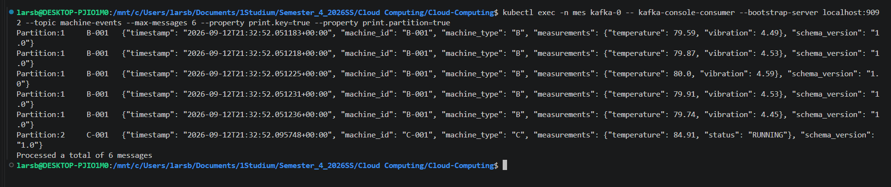
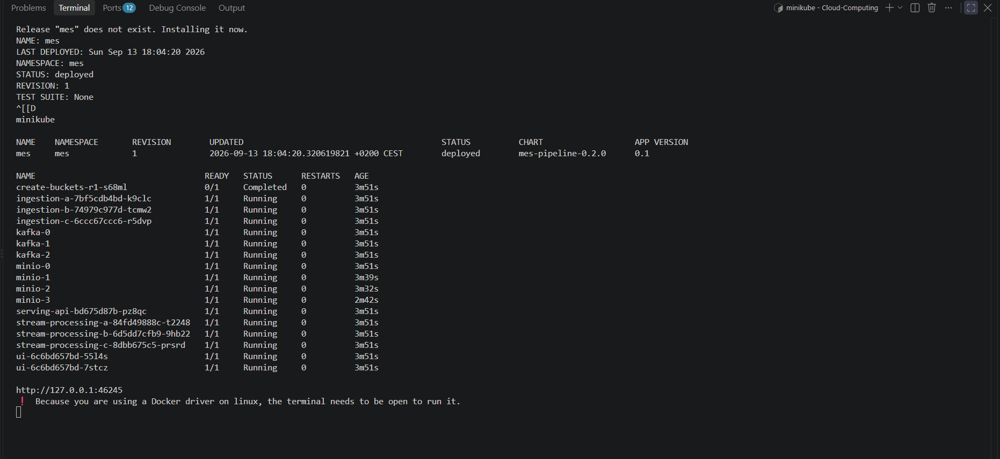
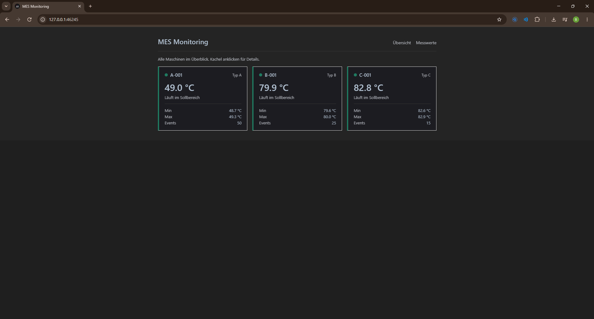

# MES Streaming Pipeline auf Kubernetes

> Prüfungsleistung **Cloud Computing und Big Data 2026** (DHBW, Prof. Dr.-Ing. habil. Dennis Pfisterer).
> Datengetriebener Big-Data-Prototyp: ein vereinfachtes **Manufacturing Execution System (MES)**-Monitoring,
> streaming-first (Kappa) und deklarativ auf Kubernetes betrieben.

Dieses Dokument ist das **alleinige Berichtsdokument** für die Abgabe.

---

Hinweis zur KI-Nutzung: In diesem Projekt wurde KI-Unterstützung genutzt (u. a. Claude Code und ChatGPT), unter anderem zur Fehlerdiagnose, bei der Dokumentation und punktuell in der Umsetzung einzelner Komponenten. Architekturentscheidungen, Code-Verständnis und die Verantwortung für das Ergebnis liegen bei uns als Team, die KI wurde als Werkzeug eingesetzt, nicht als Ersatz für eigenes Verständnis.

---

## Aufgabenverteilung

| # | Komponente | Matrikelnr. | Ordner |
|---|------------|-------------|--------|
| 1 | Ingestion & Datengeneratoren | **3317974**, 4576203 | [`ingestion/`](ingestion/) |
| 2 | Kafka & Storage-Layer (MinIO) | **4576203** | [`ingestion/storage/`](ingestion/storage/), [`charts/mes-pipeline/templates/kafka.yaml`](charts/mes-pipeline/templates/kafka.yaml), [`charts/mes-pipeline/templates/minio.yaml`](charts/mes-pipeline/templates/minio.yaml) |
| 3 | Stream Processing (Spark) | **3661988** | [`stream-processing/`](stream-processing/) |
| 4 | Serving-API (FastAPI) | **5333240** | [`serving-api/`](serving-api/) |
| 5 | User-facing UI | **1729291** | [`ui/`](ui/) |
| 6 | Kubernetes-Deployment, Kompaktierung & Doku (Integrator) | **2010638** | [`charts/mes-pipeline/`](charts/mes-pipeline/), [`terraform/`](terraform/), [`ansible/`](ansible/), [`docs/`](docs/) |

Fett ist jeweils die Hauptverantwortung. Jede Person hat unter ihrem eigenen Git-Konto
committet; die Zuordnung der Commits zu den Komponenten ergibt sich aus den Pfaden in der
History (`git log --stat -- <ordner>`).

Details zum Arbeitsablauf: siehe [CONTRIBUTING.md](CONTRIBUTING.md).
Schnittstellen zwischen den Komponenten: siehe [docs/interface-contracts.md](docs/interface-contracts.md).

---

## Inhaltsverzeichnis

- [1. Use Case und Motivation](#1-use-case-und-motivation)
- [2. Datencharakteristik](#2-datencharakteristik)
- [3. Architekturentscheidung: Kappa](#3-architekturentscheidung-kappa)
- [4. Komponenten und Datenfluss](#4-komponenten-und-datenfluss)
- [5. Processing-Logik](#5-processing-logik)
- [6. Speicherkonzept](#6-speicherkonzept)
- [7. User-facing UI](#7-user-facing-ui)
- [8. Kubernetes-Deployment](#8-kubernetes-deployment)
- [9. Deployment-Anleitung](#9-deployment-anleitung)
- [10. Wesentliche Codeabschnitte](#10-wesentliche-codeabschnitte)
- [11. Screenshots und Nachweise](#11-screenshots-und-nachweise)
- [12. Grenzen und Ausblick](#12-grenzen-und-ausblick)

---

## 1. Use Case und Motivation

Eine Fertigung betreibt Maschinen unterschiedlicher Generationen und Hersteller. Jede meldet
Betriebsdaten, Temperatur, Druck, Vibration, Status, aber jede in ihrem **eigenen Rohformat**,
so wie es in gewachsenen Werkslandschaften tatsächlich ist. Ein *Manufacturing Execution System*
(MES) führt diese Ströme zusammen und überwacht sie nahezu in Echtzeit: Läuft jede Maschine?
Überschreitet eine die Temperaturgrenze? Wie sah der Verlauf der letzten Stunde aus?

**Wer hat welchen Schmerz.** Die Schichtleitung will auf einen Blick sehen, welche Maschine
gerade außerhalb ihres Sollbereichs läuft, ohne drei Herstellerportale zu öffnen. Die
Instandhaltung will nach einem Ausfall den Temperaturverlauf der letzten Minuten sehen, nicht
erst am nächsten Tag aus einem Batch-Report. Beide brauchen dieselben Daten, aber mit
unterschiedlicher Latenz-Toleranz: Sekunden für die Übersicht, Minuten für die Analyse.

**Datenquelle.** Drei simulierte Maschinentypen (A, B, C) mit je eigenem Rohformat und eigener
physikalischer Dynamik (Aufheizen, Kühlen, Betriebspausen, Fehlerzustände), siehe §2 und
[`ingestion/simulators/`](ingestion/simulators/). Die Simulation ersetzt reale Maschinen, das
Datenformat und die Verarbeitungskette sind aber so gebaut, wie sie auch mit echten
Maschinenanbindungen aussähen.

**Warum das ein Big-Data-Problem ist**, nicht wegen der Datenmenge des Prototyps, die ist klein,
sondern wegen der Struktur des Problems:

- **Unbegrenzter Datenstrom** statt abgeschlossener Datei. Es gibt kein „Ende" der Daten, also
  auch keinen Zeitpunkt, an dem man „alles" auswerten könnte. Auswertung muss *laufend* geschehen.
- **Heterogenität als Normalfall.** Drei Formate heute, zehn morgen. Normalisierung muss eine
  eigene Architekturschicht sein, kein `if`-Zweig.
- **Entkopplung.** Datenerzeuger, Verarbeitung und Anzeige dürfen sich nicht gegenseitig
  blockieren. Genau dafür sitzt ein Broker dazwischen.
- **Horizontale Skalierung.** Mehr Maschinen dürfen mehr Instanzen bedeuten, aber keine
  Neuentwicklung.

Die Architektur ist damit auf ein Volumen ausgelegt, das der Prototyp bewusst nicht erzeugt.

---

## 2. Datencharakteristik

### Volume

Die Simulatoren erzeugen je Durchlauf 10 Events von Maschinentyp A, 5 von B und 3 von C und
pausieren dann zwei Sekunden, also **18 Events alle 2 Sekunden** über die drei
Ingestion-Instanzen zusammen (`ingestion-a` 10, `ingestion-b` 5, `ingestion-c` 3; siehe
[`ingestion/main.py`](ingestion/main.py)).

| Größe | Prototyp | Hochgerechnet (500 Maschinen, 1 Hz) |
|---|---|---|
| Ereignisrate | 9 Events/s | 500 Events/s |
| Events pro Tag | ≈ 778.000 | ≈ 43.200.000 |
| Rohvolumen/Tag (JSON ≈ 160 B) | ≈ 124 MB | ≈ 6,9 GB |
| Aggregate/Tag (10-s-Fenster) | ≈ 26.000 Zeilen | ≈ 4,3 Mio. Zeilen |

124 MB am Tag sind kein Big Data. Die Architektur trägt die rechte Spalte, der Prototyp erzeugt
die linke, das ist eine bewusste Entscheidung und keine Auslassung. Wie sich diese scheinbar
kleine Zeilenzahl trotzdem in ein handfestes Dateisystem-Problem verwandelt, zeigt §6.

### Velocity

Kontinuierlicher Strom ohne Ende. Die Verarbeitung erfolgt in 10-Sekunden-Fenstern über
Event-Time mit einer Watermark von 30 Sekunden (siehe §5); verspätete Ereignisse innerhalb
dieses Fensters werden noch berücksichtigt, spätere verworfen.

**Latenzanforderung.** Die Übersichtskacheln sollen den Zustand einer Maschine innerhalb von
unter einer Minute nach dem Ereignis zeigen. Das Latenzbudget setzt sich zusammen aus:

| Schritt | Beitrag |
|---|---|
| Ingestion-Takt | ≤ 2 s |
| Fenster schließt (10-s-Fenster) | ≤ 10 s |
| Watermark (Fenster wird erst nach 30 s Event-Time als abgeschlossen ausgegeben) | 30 s |
| Micro-Batch-Trigger des Silver-Writers | ≤ 10 s |
| API-Cache (TTL 30 s) + UI-Polling (5 s) | ≤ 35 s |
| **Summe (worst case)** | **≈ 90 s**, typisch 40–60 s |

Die Ingest-Rate von 9 Events/s liegt weit unter dem, was ein einzelner Kafka-Broker verkraftet.
Die Architektur ist auf die hochgerechnete Rate von 500 Events/s und mehr ausgelegt, weil die
Skalierungsachse (je eine Ingestion- und Stream-Processing-Instanz pro Maschinentyp, mit der
Kafka-Partitionszahl als nächster Ausbaustufe, siehe §8)
davon unabhängig ist.

### Variety

Drei Rohformate werden in der Ingestion auf ein einheitliches Schema normalisiert. Das ist der
eigentliche fachliche Kern des Use Case:

| Maschinentyp | Format | Beispiel |
|---|---|---|
| A | JSON, flach | `{"timestamp": "...", "machine_id": "A-001", "status": "RUNNING", "temperature": 78.3, "pressure": 4.1, "rotation_speed": 1500.2, "power_consumption": 12.4, "runtime_seconds": 3600.0}` |
| B | JSON, andere Feldnamen | `{"ts": "...", "id": "B-001", "temp": 65.8, "vibration": 3.2}` |
| C | Pipe-separiert | `2026-09-07T14:00:00\|C-001\|88.1\|RUNNING` |

Schon zwischen A und B unterscheiden sich die Feldnamen (`timestamp`/`ts`, `machine_id`/`id`,
`temperature`/`temp`), die Normalisierung darf sich also nicht auf gleiche Schlüssel verlassen.
Die drei Parser in [`ingestion/parsers/`](ingestion/parsers/) bilden alle drei Formate auf
dasselbe Envelope-Schema ab (`timestamp`, `machine_id`, `machine_type`, generische
`measurements`-Map, `schema_version`), siehe
[`ingestion/schema/unified_schema.py`](ingestion/schema/unified_schema.py).

### Veracity

Nicht jedes Ereignis trägt jedes Feld. Einen Betriebsstatus melden nur die Typen A
(`OFF`/`STARTING`/`RUNNING`/`COOLING`/`ERROR`) und C (`RUNNING`/`PAUSED`), Typ B gar keinen;
Druck und Drehzahl liefert nur A, Vibration nur B. Die Verarbeitung muss mit fehlenden Feldern
umgehen, statt sie vorauszusetzen, im Silver-Schema ist `last_status` deshalb für Typ B
dauerhaft `null`, und die API wandelt `NaN` explizit in `null` um, statt einen Serverfehler zu
werfen.

---

## 3. Architekturentscheidung: Kappa

Wir setzen eine **Kappa-Architektur** um: ein einziger Verarbeitungspfad für alle Daten,
Streaming als Standardfall. Kein separater Batch-Zweig.


*Jede farbige Box ist ein Workload im Helm-Chart (die weißen Kästen in MinIO sind Tabellen), jeder Pfeil ein tatsächlicher Datenfluss. Die
Komponenten im Einzelnen und ihre Technologiewahl: §4. Abbildung auf Kubernetes-Workloads: §8.*

**Warum nicht Lambda.** Lambda führt zwei Pfade parallel, einen für Echtzeit und einen für
Genauigkeit. Der Preis ist, dieselbe Logik zweimal zu implementieren und konsistent zu halten,
für ein Team dieser Größe und einen Anwendungsfall, der ohnehin auf Aktualität zielt, ein
schlechtes Verhältnis. Historische Auswertungen decken wir stattdessen über die Kafka-Retention
und das Parquet-Archiv ab.

**Die Umsetzung ist „Practical Kappa": Log plus Objektspeicher-Archiv.**

| Medallion-Schicht | Üblicherweise | Bei uns |
|---|---|---|
| **Bronze**, Rohdaten | im Data Lake | **Kafka-Log** (7 Tage Retention) **und** ein materialisiertes Archiv in MinIO (`bronze/machine-events`), siehe §6 |
| **Silver**, bereinigt, aggregiert | im Data Lake | `mes-data/silver/machine-metrics` + `mes-data/silver/machine-status` als Parquet |
| **Gold**, kuratiert, geschäftsnah | im Data Lake | **nicht materialisiert**, die Serving-API aggregiert beim Lesen |

### Einordnung ins Lakehouse-Schichtenmodell

| Schicht | Beispiele der Vorlesung | Unsere Wahl |
|---|---|---|
| Compute Engine | Spark, Flink, Trino | **Spark Structured Streaming** |
| Katalog | Hive Metastore, Unity Catalog | **keiner**, bewusste Lücke |
| Open Table Format | Delta, Iceberg, Hudi | **keines**, bewusste Lücke, siehe §12 |
| Dateiformat | Parquet, ORC | **Parquet** |
| Objektspeicher | S3, SeaweedFS, HDFS | **MinIO** |

Vier von fünf Schichten sind besetzt. Die beiden offenen sind der Grund, warum wir kein ACID und
keine Schema-Evolution haben, siehe §12.

---

## 4. Komponenten und Datenfluss

Ende-zu-Ende: Simulator → Parser → Kafka-Topic `machine-events` → Spark (Filter, Fenster,
Anreicherung) → Parquet in MinIO (Bronze + Silver) → Serving-API (liest Silver) → UI
(pollt die API). Das Diagramm dazu steht in §3.

| Komponente | Ordner | Matrikelnr. | Aufgabe |
|---|---|---|---|
| Ingestion (× 3) | [`ingestion/`](ingestion/), [README](ingestion/README.md) | 3317974, 4576203 | Simulatoren, Normalisierung, Kafka-Producer, je Instanz ein Maschinentyp |
| Kafka | [`charts/mes-pipeline/templates/kafka.yaml`](charts/mes-pipeline/templates/kafka.yaml) | 4576203 | Broker im KRaft-Modus (3 Broker), Topic `machine-events`, 3 Partitionen |
| Stream Processing (× 3) | [`stream-processing/`](stream-processing/), [README](stream-processing/README.md) | 3661988 | Spark Structured Streaming, je Instanz ein Maschinentyp |
| MinIO | [`ingestion/storage/`](ingestion/storage/), [README](ingestion/storage/README.md) | 4576203 | S3-kompatibler Objektspeicher (4-Node Distributed Mode), Bronze- und Silver-Schicht |
| Kompaktierung (× 2 CronJobs) | [`charts/mes-pipeline/templates/compaction-cronjob.yaml`](charts/mes-pipeline/templates/compaction-cronjob.yaml), [`bronze-compaction-cronjob.yaml`](charts/mes-pipeline/templates/bronze-compaction-cronjob.yaml) | 2010638 | Fasst viele kleine Streaming-Dateien periodisch zu großen zusammen, siehe §6 |
| Serving-API | [`serving-api/`](serving-api/), [README](serving-api/README.md) | 5333240 | Abfrage-Endpunkte über der Silver-Schicht |
| UI | [`ui/`](ui/), [README](ui/README.md) | 1729291 | Dashboard |
| Deployment | [`charts/mes-pipeline/`](charts/mes-pipeline/), [README](charts/mes-pipeline/README.md) | 2010638 | Helm-Chart, Cluster-Bereitstellung (Terraform + Ansible/k3s) |

**Warum ein Broker dazwischen.** Ohne Kafka wären Ingestion und Verarbeitung fest gekoppelt: Ein
kurzer Ausfall der Verarbeitung würde Ereignisse verlieren, und eine langsame Verarbeitung würde
die Erzeugung ausbremsen. Mit Kafka warten die Ereignisse, die Verarbeitung holt sie nach, und
ein fehlerhafter Lauf lässt sich durch Zurücksetzen des Offsets auf **denselben** Daten
wiederholen.

**Warum `machine_id` als Kafka-Key, und warum trotzdem eine explizite Partitionszuordnung.**
Derselbe Key landet immer in derselben Partition. Dadurch bleibt die zeitliche Reihenfolge je
Maschine garantiert, auch wenn mehrere Konsumenten parallel lesen. Mit nur drei verschiedenen
Keys (`A-001`, `B-001`, `C-001`) kann der Standard-Hash-Partitionierer aber alle drei zufällig
auf dieselbe Partition legen, die effektive Parallelität wäre dann 1 statt 3. Der Producer
ordnet bekannte Maschinen deshalb explizit einer Partition zu
([`ingestion/producer/kafka_producer.py`](ingestion/producer/kafka_producer.py#L31)),
unbekannte Maschinen laufen weiter über den Standard-Partitionierer. Die Partitionszahl ist
damit gleichzeitig die Obergrenze der Parallelität, siehe §8.

**Technologiewahl je Komponente.**

| Komponente | Gewählt | Warum diese und keine andere |
|---|---|---|
| Ingestion | Python, `kafka-python` | Simulator und Parser sind reine Datenlogik ohne Framework-Bedarf; ein Container-Build, per `MACHINE_TYPES` mehrfach deploybar |
| Broker | Apache Kafka (KRaft, ohne ZooKeeper) | Partitionierter, persistenter Log mit Offset-Replay, genau die Eigenschaft, die Kappa braucht; KRaft spart einen zweiten StatefulSet |
| Stream Processing | Spark Structured Streaming | Event-Time-Windowing, Watermarks und Checkpointing sind eingebaut; Kafka-Source und S3A-Sink sind Standardkonnektoren; Lehrstoff der Vorlesung |
| Storage | MinIO (S3-API) + Parquet | Spark (`s3a://`) und pandas (`s3fs`) sprechen beide nativ S3, kein eigener Treiber nötig; Begründung gegenüber HDFS in §6 |
| Serving | FastAPI + pandas/pyarrow | Zwei Lese-Endpunkte über Parquet mit Partition Pruning; automatische OpenAPI-Doku; kein Query-Engine-Cluster nötig, weil die Silver-Schicht klein bleibt |
| UI | Dash (Plotly) | Reine Anzeige-Rolle, Python-Stack wie der Rest, Zeitreihen-Charts eingebaut; Polling statt WebSocket, damit die UI-Pods zustandslos bleiben |
| Deployment | Helm-Chart, ein Chart für minikube und DHBW Cloud | `range` über Instanzlisten und eine einzige `values-dhbw.yaml` als Umgebungs-Overlay; siehe §8/§9 |

**Was außerdem im Chart steckt, aber im Diagramm nicht als Box erscheint.** Ein Job
`create-buckets-r<Revision>` legt bei jedem `helm install`/`upgrade` die Buckets `mes-data` und
`spark-checkpoints` an ([`minio.yaml`](charts/mes-pipeline/templates/minio.yaml#L97)). Er ist
bewusst **kein** Helm-Hook: Hooks laufen erst, wenn `--wait` alle Workloads bereit sieht, und
das wären sie ohne Buckets nie (§9, „Was der frische Durchlauf gefunden hat"). Als normaler
Job startet er parallel zum Rollout, wartet in einer Schleife auf MinIO und räumt sich per
`ttlSecondsAfterFinished` selbst auf. Er nutzt das ohnehin vorhandene MinIO-Image (das `mc`
enthält) statt eines separaten `minio/mc:latest`, ein ungepinntes Docker-Hub-Image hat den
Upgrade einmal auf einem Knoten ohne Image-Cache scheitern lassen. Dazu kommen die ConfigMap
`pipeline-config`, das Secret `minio-credentials` und ein auf `deployments` beschränkter
ServiceAccount für die CI (§9).

**Warum Ingestion und Stream Processing als je drei Instanzen statt einer.** Beide Komponenten
sind entlang derselben Achse (Maschinentyp) horizontal aufgeteilt, nicht über naive
Replica-Vervielfachung, Details und Begründung in §8.

---

## 5. Processing-Logik

Jede der drei Stream-Processing-Instanzen liest aus Kafka (gefiltert auf ihren Maschinentyp),
aggregiert über Event-Time-Fenster und schreibt nach MinIO.

| Baustein | Umsetzung |
|---|---|
| Fenster | 10 Sekunden über Event-Time |
| Late Data | Watermark von 30 Sekunden |
| Aggregate | Durchschnitts-, Minimal- und Maximaltemperatur, Event Count |
| State | letzter bekannter Maschinenstatus (`last_status`) |
| Anreicherung | Grenzwert `TEMP_LIMIT` aus der ConfigMap, Flag `limit_exceeded` |
| Ausgabe | Parquet in `mes-data/silver/machine-metrics`, partitioniert nach `machine_type`/`event_date` |
| Wiederanlauf | Checkpoints in `spark-checkpoints`, je Instanz und je Query ein eigener Pfad |

Alles davon steht in einer Datei, [`stream-processing/streaming_job.py`](stream-processing/streaming_job.py):

1. **Parsen.** Die Kafka-Nachricht wird per `from_json` gegen das Envelope-Schema gelesen; die
   generische `measurements`-Map wird in benannte Spalten (`temperature`, `pressure`,
   `vibration`, `status`) aufgelöst, fehlende Schlüssel werden `null`
   ([Zeile 83–95](stream-processing/streaming_job.py#L83-L95)).
2. **Filtern.** `machine_type IN MACHINE_TYPES`, jede Instanz behält nur ihren Typ
   ([Zeile 97](stream-processing/streaming_job.py#L97)). Das ist die Grundlage der horizontalen
   Skalierung in §8.
3. **Drei Queries aus demselben Quell-DataFrame:**

| Query | Transformation | Output-Mode | Ziel |
|---|---|---|---|
| Bronze | nur `event_date` ergänzen, **keine** Watermark | `append` über `foreachBatch` | `bronze/machine-events/machine_type=<X>/`, partitioniert nach `event_date` |
| Silver-Metrics | `withWatermark(30 s)` → `window(10 s)` × `machine_id` → `avg/min/max(temperature)`, `count(*)`, `max_by(status, timestamp)` → `limit_exceeded = max_temperature > TEMP_LIMIT` ([Zeile 112–137](stream-processing/streaming_job.py#L112-L137)) | `append` über `foreachBatch`, Trigger alle 10 s | `silver/machine-metrics/machine_type=<X>/`, partitioniert nach `event_date` |
| Silver-Status | `groupBy(machine_id)` → `max_by(status, timestamp)` als `last_status` ([Zeile 104–109](stream-processing/streaming_job.py#L104-L109)) | `complete` über `foreachBatch`, `overwrite` des eigenen `machine_type`-Ordners | `silver/machine-status/machine_type=<X>/` |

Alle drei Writer schreiben über `foreachBatch` **direkt in den `machine_type`-Ordner ihrer
Instanz** statt per `partitionBy("machine_type", …)` in die Tabellenwurzel. Für Leser ist das
Ergebnis identisch (Hive-Partitionslayout `machine_type=A/event_date=…/`), aber die
Verwaltungsverzeichnisse, die Spark beim Schreiben anlegt, liegen damit je Instanz getrennt,
warum das nötig war, steht in §6.

**Windowing.** Tumbling Windows von 10 Sekunden über der Event-Time-Spalte `timestamp`. Jedes
Fenster liefert je Maschine eine Zeile mit Durchschnitts-, Minimal- und Maximaltemperatur sowie
der Ereigniszahl, bei 10 Events/2 s für Typ A also ~50 Events pro Fenster. Das ist die
nicht-triviale Transformation: aus 9 Rohereignissen pro Sekunde werden 3 Aggregatzeilen pro
10 Sekunden.

**Stateful Processing.** Die Status-Query ist zustandsbehaftet im engeren Sinne: Sie läuft im
`complete`-Modus ohne Watermark, hält also je Maschine den zuletzt gesehenen Status als
Spark-State über alle Micro-Batches hinweg und schreibt bei jedem Batch die komplette
Zustandstabelle neu. Der Zustand ist auf die Zahl der Maschinen begrenzt, wächst also nicht mit
der Zeit. Zusätzlich trägt jedes Silver-Fenster über `max_by(status, timestamp)` den letzten
Status *innerhalb des Fensters*. Beides liegt im Checkpoint, ein Pod-Neustart setzt darauf auf.

**Anreicherung.** `TEMP_LIMIT` kommt aus der ConfigMap `pipeline-config`
([`configmap.yaml`](charts/mes-pipeline/templates/configmap.yaml), Wert `85`) und wird als
Spalte `temperature_limit` in jede Silver-Zeile geschrieben, dazu das Flag `limit_exceeded`.
Weil der Wert *in* den Daten steht, lässt sich später nachvollziehen, welcher Grenzwert zum
Zeitpunkt der Aggregation galt, auch nach einer Änderung der ConfigMap.

**Warum Event-Time und nicht Verarbeitungszeit.** Ein Ereignis, das wegen einer Netzstörung
zehn Sekunden später ankommt, gehört fachlich in das Fenster seiner Entstehung, nicht in das
seiner Ankunft. Nur so bleiben die Aggregate über Wiederholungen hinweg identisch.

**Late Data: warum eine Watermark nötig ist und was sie genau tut.** Ohne sie müsste Spark
jedes Fenster unbegrenzt offen halten, falls doch noch ein spätes Ereignis kommt, der Zustand
würde monoton wachsen. Die Watermark ist die explizite Zusage: Ein Ereignis, dessen
Event-Time mehr als 30 Sekunden hinter dem jüngsten bisher gesehenen Zeitstempel liegt, wird
für die Aggregation verworfen; ein Fenster gilt als abgeschlossen und wird im `append`-Modus
erst ausgegeben, wenn die Watermark sein Ende überschritten hat. Zwei Konsequenzen, die man
kennen muss:

- Die Ausgabe-Latenz eines Fensters beträgt mindestens Fensterlänge + Watermark (≈ 40 s), das
  ist der Preis für korrekte Aggregate bei verspäteten Ereignissen.
- Verworfen wird nur in der **Silver**-Aggregation. Die Bronze-Query hat bewusst keine Watermark,
  jedes Ereignis landet also unabhängig von seiner Verspätung im Rohdaten-Archiv, und im
  Kafka-Log ohnehin. Ein später erkannter Verlust lässt sich damit durch Offset-Reset oder aus
  Bronze nachverarbeiten, wie es die Kappa-Idee vorsieht.

**Warum genau 30 Sekunden, eine Lektion aus dem Betrieb.** Der Wert stand ursprünglich bei 20s.
Solange eine einzelne Instanz alle drei Maschinentypen zugleich verarbeitete, dauerte ein
Micro-Batch teils 12–15s gegen einen 10s-Trigger, Ereignisse kamen dadurch regelmäßig „zu spät"
relativ zur Watermark und wurden lautlos verworfen (kein Fehler, keine Log-Zeile, nur fehlende
Zeilen in Silver). Kurzfristig auf 60s angehoben, um das abzufedern. Nach dem Aufteilen in drei
parallele, je auf einen Maschinentyp gefilterte Instanzen (siehe §8) sank die Aggregationslast pro Instanz
auf ein Drittel (jede Instanz liest zwar weiterhin das ganze Topic, aggregiert und schreibt
aber nur ihren Typ), wodurch 30s als Kompromiss aus Sicherheitsmarge und UI-Aktualität reicht.

---

## 6. Speicherkonzept

### Format

**Parquet.** Spaltenorientiert, komprimiert und mit eingebettetem Schema. Für die Abfragen der
Serving-API, „Durchschnittstemperatur je Maschine der letzten Stunde", werden nur wenige
Spalten gelesen; ein zeilenorientiertes Format wie CSV oder JSON müsste jedes Mal alles lesen.

**Warum Parquet ohne Delta Lake/Iceberg.** Delta hätte uns ACID-Commits und Schema-Evolution
gegeben, und damit das Kompaktierungsproblem unten eleganter gelöst. Wir haben es trotzdem
nicht eingesetzt, aus einem konkreten Grund: Der Lesepfad ist nicht Spark, sondern
pandas/pyarrow in der Serving-API. Delta hätte dort eine zweite Reader-Bibliothek
(`deltalake`) mit eigener Versionsabstimmung gegen Spark 4.2 erfordert; reines Parquet lesen
beide Seiten ohne Zusatzschicht. Die Konsequenzen (kein ACID, keine Schema-Evolution) sind in
§12 benannt, die konkrete Lücke (Commit-Konflikte bei paralleler Kompaktierung) ist mit Retries
abgefangen. Delta ist der erste Punkt im Ausblick.

**Warum ein Data Lake auf Objektspeicher, und warum MinIO statt HDFS.** Das Speicherkonzept
ist ein Data Lake im Sinne der Vorlesung: offene Dateiformate auf einem günstigen, horizontal
skalierbaren Speicher, getrennt vom Compute (Spark schreibt, pandas liest, beide ohne
gemeinsamen Prozess). Wir haben dafür bewusst nicht HDFS gewählt, das in der Vorlesung als
Standard gezeigt wird:

| | HDFS | MinIO (S3-API) |
|---|---|---|
| Kubernetes-Betrieb | NameNode + DataNodes, zwei Workload-Typen mit unterschiedlicher Rolle, NameNode als Single Point of Failure ohne HA-Setup | ein StatefulSet mit gleichartigen Pods, Erasure Coding verteilt Redundanz symmetrisch |
| Zugriff aus Python | `hdfs://` braucht Hadoop-Client oder WebHDFS | `s3fs`/`pyarrow` sprechen S3 nativ, dieselbe Zugriffsschicht wie bei AWS S3 |
| Zugriff aus Spark | nativ | nativ über `s3a://` (`hadoop-aws`) |
| Portabilität | an das Hadoop-Ökosystem gebunden | dieselben Pfade und Credentials laufen unverändert gegen AWS S3, Ceph, SeaweedFS |
| Footprint | JVM-Prozesse mit hohem Speicherbedarf | ein Go-Binary, 256 Mi Request pro Knoten |

Das ist die *begründete Abweichung* vom gelehrten Standardweg im Sinne des Bonus-Kriteriums:
weniger bewegliche Teile auf Kubernetes, ein Protokoll (S3) für beide Zugriffsseiten, und ein
Speicherpfad, der ohne Codeänderung in eine Public Cloud umziehen könnte.

### Schema

Die Tabellen sind schemabehaftet über die eingebetteten Parquet-Metadaten; die logische
Definition liegt zusätzlich als DDL-Notation in
[`ingestion/storage/schema.sql`](ingestion/storage/schema.sql).

**`silver/machine-metrics`**, eine Zeile je Maschine und 10-s-Fenster (geschrieben in
[`streaming_job.py`](stream-processing/streaming_job.py#L127-L137)):

| Spalte | Typ | Bedeutung |
|---|---|---|
| `machine_id`, `machine_type` | string | Gruppierung; `machine_type` ist Partitionsspalte |
| `window_start`, `window_end` | timestamp | Fenstergrenzen (Event-Time) |
| `avg_temperature`, `min_temperature`, `max_temperature` | double, nullable | Aggregate über das Fenster |
| `event_count` | long | Anzahl Ereignisse im Fenster |
| `last_status` | string, nullable | letzter Status im Fenster (`null` bei Typ B) |
| `temperature_limit` | double | zum Zeitpunkt der Aggregation geltender Grenzwert |
| `limit_exceeded` | boolean | `max_temperature > temperature_limit` |
| `event_date` | date | Partitionsspalte, aus `window_start` |

**`silver/machine-status`**, eine Zeile je Maschine, bei jedem Batch komplett neu geschrieben:

| Spalte | Typ | Bedeutung |
|---|---|---|
| `machine_id` | string | |
| `machine_type` | string | Partitionsspalte |
| `last_status` | string | zuletzt gesehener Status über alle Zeit |
| `last_timestamp` | timestamp | Event-Time dieses Status |

**`bronze/machine-events`**, eine Zeile je Rohereignis:

| Spalte | Typ | Bedeutung |
|---|---|---|
| `timestamp` | timestamp | Event-Time |
| `machine_id`, `machine_type` | string | |
| `measurements` | map<string,string> | die vollständige, generische Messwert-Map aus dem Kafka-Event |
| `temperature`, `pressure`, `vibration` | double, nullable | aus `measurements` extrahiert |
| `status` | string, nullable | aus `measurements` extrahiert |
| `schema_version` | string | `"1.0"` |
| `event_date` | date | Partitionsspalte |

Bronze behält die Map bewusst zusätzlich zu den extrahierten Spalten: Ein neues Messfeld eines
Maschinentyps (z. B. `rotation_speed`) liegt damit schon in Bronze, auch wenn Silver es noch
nicht auswertet.

### Partitionierung

| Tabelle | Partitioniert nach | Warum |
|---|---|---|
| `silver/machine-metrics` | `machine_type`, `event_date` | Die Serving-API filtert praktisch immer nach Zeitraum (Partition Pruning über `event_date`); `machine_type` verhindert zusätzlich, dass die drei parallelen Stream-Processing-Instanzen sich beim Schreiben gegenseitig überschreiben |
| `silver/machine-status` | `machine_type` | Gleicher Grund: drei parallele Schreiber, ein Ziel, ohne Partitionierung würde `mode("overwrite")` den Status der jeweils anderen zwei Maschinentypen löschen |
| `bronze/machine-events` | `machine_type`, `event_date` | Rohablage; `machine_type` aus demselben Grund wie oben (getrennte Schreibpfade der drei Instanzen), `event_date` für die tageweise Kompaktierung und spätere Nachverarbeitung |

**Warum nicht nach `machine_id`.** Bei potenziell vielen Maschinen entstünde eine sehr große
Zahl kleiner Partitionen. `machine_type` hat nur drei Ausprägungen und deckt trotzdem den
Konflikt zwischen den parallelen Schreibern auf Datenebene ab.

**Was die Partitionierung allein nicht abdeckt.** `partitionBy("machine_type")` trennt die
Daten-Ordner, nicht die Verwaltungsverzeichnisse, die Spark unter dem Schreibpfad anlegt
(`_temporary` des Output-Committers, `_spark_metadata` des Streaming-File-Sinks). Solange
alle drei Instanzen die Tabellenwurzel als Schreibpfad nutzten, teilten sie sich diese
Verzeichnisse und kamen sich darin in die Quere; im Betrieb ist das passiert, Details unten. Deshalb schreibt jede Instanz jetzt direkt in `…/machine_type=<X>/` als Schreibpfad; das
Layout bleibt gleich, die Staging-Verzeichnisse sind disjunkt.

### Das Small-Files-Problem, und warum es zwei CronJobs gibt

Spark Structured Streaming schreibt bei jedem Micro-Batch eine neue Datei. Bei einem
10-Sekunden-Trigger über mehrere Stunden Laufzeit entstehen so schnell mehrere Zehntausend
kleine Parquet-Dateien pro Partition (beobachtet: über 70.000 Objekte allein in Bronze nach
einem Tag). Jede Leseanfrage muss dann Zehntausende kleiner Dateien einzeln öffnen, was MinIO
und die Serving-API spürbar belastet, bis hin zu Anfragen, die nicht mehr in nützlicher Zeit
beantwortet werden.

Lösung: zwei Kubernetes-`CronJob`s, die periodisch die aktuelle Partition neu einlesen und als
eine einzige, große Datei zurückschreiben (`silver-compaction` alle 30 Minuten,
`bronze-compaction` alle 10 Minuten, wegen der höheren Schreibrate in Bronze durch drei parallele
Instanzen). Das ist **kein** inkrementelles Verfahren, jeder Lauf liest die komplette aktuelle
Partition (alte konsolidierte Datei plus alle neuen kleinen Dateien seit dem letzten Lauf) und
schreibt sie als eine Datei neu. Die Dateizahl folgt dadurch einem Sägezahn-Muster (kompaktiert
→ wächst bis zum nächsten Lauf → kompaktiert), akkumuliert aber nicht über die Zeit.

Zwei Besonderheiten, die der Betrieb tatsächlich gezeigt hat:

- **Bronze wurde zunächst von Sparks nativem Structured-Streaming-Sink beschrieben**, der einen
  `_spark_metadata`-Konsistenz-Log anlegt. Ein normaler Batch-Read der Tabellenwurzel nutzt
  diesen Log als Dateiliste statt einer echten Verzeichnis-Auflistung, nach einer
  Kompaktierung verweist er auf bereits gelöschte Dateien. Die Kompaktierung las deshalb bei
  einspaltiger Partitionierung direkt den Partitionsordner (der Zweig ist in `compact.py` noch
  enthalten). Inzwischen schreibt Bronze über `foreachBatch` ohne diesen Log (§5, siehe unten), und die
  Kompaktierung geht bei Bronze wie bei Silver über die Tabellenwurzel
  (`PARTITION_COLS=machine_type,event_date`).
- **`count()` und der anschließende `write()` dürfen nicht zwei unabhängige Lesevorgänge sein.**
  Ohne `.cache()` wertet Spark denselben DataFrame zweimal aus, einmal fürs Zählen, einmal
  fürs Schreiben. Läuft dazwischen ein weiterer Streaming-Micro-Batch, sieht der zweite Read
  eine andere Dateiliste als der erste, und der Commit scheitert mit `FileNotFoundError`.

### Parallele Schreiber: zwei Fehlerbilder aus dem Betrieb und ihre Lösung

Die Aufteilung in drei Stream-Processing-Instanzen (§8) hatte eine Nebenwirkung, die erst nach
Stunden Laufzeit sichtbar wurde. Beide Fehlerbilder sind in `kubectl logs` belegt (12.09.2026)
und inzwischen behoben. Sie stehen hier, weil der Lösungsweg zeigt, was Partitionierung leistet
und was nicht:

| Query | Fehler | Ursache |
|---|---|---|
| Bronze (damals nativer File-Sink) | `Race while writing batch 42726` | Alle drei Instanzen schrieben in denselben Pfad und teilten sich damit **ein** `_spark_metadata`-Log. Jede Instanz zählt ihre Batches selbst; sobald zwei Instanzen dieselbe Batch-ID committen wollten, wies der Sink den zweiten Commit ab. |
| Silver-Metrics (`foreachBatch`) | `FileNotFoundException: .../silver/machine-metrics/_temporary/0/task_…` | `partitionBy("machine_type")` trennt die Daten-Ordner, nicht das Staging-Verzeichnis `_temporary/0` des Hadoop-Output-Committers unter der Tabellenwurzel. Beendete eine Instanz ihren Job, räumte sie `_temporary` auf und zog der gerade schreibenden Nachbarinstanz die Dateien unter den Füßen weg. |

**Lösung.** Jede Instanz schreibt alle drei Ausgaben direkt in ihren eigenen
`machine_type=<X>`-Ordner statt per `partitionBy` in die gemeinsame Wurzel (§5). `_temporary`
liegt damit je Instanz getrennt, und Bronze läuft über `foreachBatch` ohne `_spark_metadata`.
Das Layout auf MinIO ist unverändert, Serving-API und Kompaktierung lesen weiter die
Tabellenwurzel. Zusätzlich beendet sich der Spark-Prozess, sobald eine seiner drei Queries
stirbt ([`streaming_job.py`](stream-processing/streaming_job.py), Ende der Datei): Kubernetes
startet den Pod neu, die Queries setzen aus ihren Checkpoints auf, Kafka hält die Ereignisse
solange vor. Vorher lief ein Pod mit halb toten Queries als `Running` weiter, weil die
Liveness-Probe nur den Prozess prüft, und die Lücke fiel erst Stunden später in der UI auf.

Die Lösung trägt, weil die Schreiber entlang derselben Achse getrennt sind wie die Partitionen.
Sobald zwei Instanzen denselben `machine_type` schreiben müssten (Ausblick in §12), bräuchte es
den S3A-„Magic Committer" oder ein transaktionales Table Format.

### Retention

Kafka hält die Rohereignisse 7 Tage (168 h) im Log. Zusätzlich läuft seit der Kompaktierung ein
dauerhaftes Rohdaten-Archiv in `bronze/machine-events` in MinIO, über die 7 Tage des
Kafka-Logs hinaus, für genau die in §3 benannte Lücke des reinen Kappa-Ansatzes.

---

## 7. User-facing UI

Die Weboberfläche zeigt die Maschinenübersicht der Pipeline live an, eine Kachel je Maschine
mit den aktuellen Aggregatwerten aus der Silver-Schicht, dazu ein Temperaturverlauf im Detail.

**Rolle.** Anzeige der verarbeiteten Ergebnisse (die zweite in der Aufgabe genannte Rolle,
Datenlieferant, übernehmen die Ingestion-Simulatoren). Die UI ist eine eigene Komponente
([`ui/`](ui/)), als eigenes Image containerisiert und als `Deployment` mit `Service` (und in
der DHBW Cloud einem TLS-`Ingress`) deployt, siehe §8.

**Datenanbindung.** Die UI spricht ausschließlich mit der Serving-API (`GET /metrics/latest` für
die Übersicht, `GET /metrics/history` für den Verlauf), kein direkter Zugriff auf Kafka, Spark
oder MinIO. Das hält das Architekturdiagramm konsistent zum tatsächlichen Datenfluss. Es gibt
keinen Mock-Betrieb im Deployment: `USE_MOCK` steht in der ConfigMap auf `false`
([`values.yaml`](charts/mes-pipeline/values.yaml)), der Mock-Zweig in
[`ui/data_source.py`](ui/data_source.py) existiert nur für die lokale Entwicklung ohne
laufende API.

| Element | Feld | Warum es überzeugt |
|---|---|---|
| Kachel je Maschine | `machine_id`, `machine_type` | zeigt, dass alle drei Rohformate ankommen |
| Aktuelle Temperatur | `avg_temperature`, `min_temperature`, `max_temperature` | zeigt die Aggregation |
| **Warnung bei Überhitzung** | `limit_exceeded` | zeigt die ConfigMap-Anreicherung |
| Status | `last_status` | zeigt den Streaming-State |
| Messwerte im Fenster | `event_count` | zeigt Windowing und Datenausfall |
| Zeitreihe | `/metrics/history` | zeigt das Data Lake |

Die Warnung bei `limit_exceeded` ist das stärkste Element: Sie beweist in einem einzigen
Screenshot, dass ein Wert aus einer Kubernetes-ConfigMap durch einen Spark-Job bis in die
Oberfläche wirkt.

**Bedienablauf.** Drei Seiten, alle über die URL adressierbar (kein Dropdown-Zustand auf
einer einzelnen Seite, damit jeder UI-Pod jede Anfrage beantworten kann):

1. **Übersicht (`/`).** Eine Kachel je Maschine mit Ampelfarbe. Weil jeder Maschinentyp sein
   eigenes Statusvokabular hat (A: `OFF`, `STARTING`, `RUNNING`, `COOLING`, `ERROR`; C:
   `RUNNING`, `PAUSED`; B: keines), bildet die UI alle Rohwerte zuerst auf ein einheitliches
   Betriebszustandsmodell mit drei Zuständen ab (`laeuft`, `steht`, `fehler`; Tabelle
   `OPERATING_STATE` in [`ui/app.py`](ui/app.py#L37)) und leitet daraus die Ampel ab: rot bei
   Fehler, gelb bei „Steht" oder bei `limit_exceeded`, sonst grün. Ein neuer Maschinentyp
   braucht nur einen Eintrag in dieser Tabelle. Die Kacheln aktualisieren sich alle 5 Sekunden per
   Polling (`POLL_INTERVAL_SECONDS` aus der ConfigMap).
2. **Detail (`/machine/<id>`).** Klick auf eine Kachel. Oben die Kennzahlen des letzten
   Fensters (Mittel/Min/Max/Grenzwert/Events/Status), darunter der Temperaturverlauf der
   letzten `HISTORY_MINUTES` (Default 15) als Linie mit Min-Max-Band und gestrichelter
   Grenzwertlinie. Für Zeiträume über zwei Stunden (Parameter `minutes` der API; die deployte
   UI fragt fest 15 Minuten an) verdichtet die API die 10-s-Fenster serverseitig zu
   5-Minuten-, 15-Minuten- oder Stundenmitteln, damit ein Chart nicht mit Zehntausenden
   Punkten kämpft.
3. **Messwerte (`/messwerte`).** Alle Fenster aller Maschinen der letzten `HISTORY_MINUTES`
   als sortier- und filterbare Tabelle, Zeilen mit `limit_exceeded` rot hinterlegt.

Fällt die API aus, zeigt die UI „Keine Maschinendaten verfügbar" statt einer Fehlerseite
([`ui/data_source.py`](ui/data_source.py#L122)).

---

## 8. Kubernetes-Deployment

Alles läuft im Namespace `mes` aus einem einzigen Helm-Chart
([`charts/mes-pipeline/`](charts/mes-pipeline/), [README](charts/mes-pipeline/README.md)).

### Abbildung der Komponenten auf Workloads

| Komponente | Workload-Typ | Warum dieser Typ | Service | Persistenz | Probes |
|---|---|---|---|---|---|
| Kafka | **StatefulSet** `kafka`, 3 Replicas, `podManagementPolicy: Parallel` | Broker brauchen stabile Netzwerknamen (`kafka-0..2.kafka.mes.svc`) für das KRaft-Quorum und je eine eigene Platte | Headless, `publishNotReadyAddresses: true` | PVC je Broker, 5 Gi | TCP 9092 |
| MinIO | **StatefulSet** `minio`, 4 Replicas | Distributed Mode adressiert die Knoten per Namen (`minio-{0...3}`); Erasure Coding braucht feste Zuordnung Pod ↔ Platte | Headless + ClusterIP (`minio:9000`, Konsole 9001) | PVC je Knoten, 10 Gi | HTTP `/minio/health/*` |
| Ingestion | **3 Deployments** `ingestion-a/b/c`, je 1 Replica | zustandslos, aber je Typ genau eine Instanz (siehe unten) | keiner (nur Producer) | keine | `pgrep main.py` |
| Stream Processing | **3 Deployments** `stream-processing-a/b/c`, je 1 Replica, `strategy: Recreate`, Init-Container wartet auf Kafka und MinIO | Zustand liegt im Checkpoint in MinIO, nicht im Pod; `Recreate` verhindert zwei Instanzen auf demselben Checkpoint während eines Rollouts; der Init-Container verhindert Fehlstarts bei einem frischen Install, bevor MinIO bereit ist | keiner | Checkpoints in MinIO (Bucket `spark-checkpoints`) | `pgrep streaming_job.py`, erst nach 150 s (Spark-Start) |
| Kompaktierung | **2 CronJobs** `silver-compaction` (\*/30), `bronze-compaction` (\*/10), `concurrencyPolicy: Forbid` | kurze, periodische Batch-Arbeit; ein Dauer-Pod würde Ressourcen binden und hätte keine Lauf-Historie | keiner | keine | keine |
| Serving-API | **Deployment** `serving-api` + **HPA** | zustandslos (Cache pro Pod ist nur Beschleunigung) | ClusterIP `serving-api:8000` | keine | `/health` (liveness, startup), `/ready` (prüft MinIO-Lesbarkeit) |
| UI | **Deployment** `ui`, 2 Replicas | zustandslos, Zustand steckt in der URL | NodePort 30080 (minikube) bzw. ClusterIP + Ingress mit TLS (DHBW) | keine | `/health` |
| Bucket-Anlage | **Job** `create-buckets-r<Revision>`, bewusst kein Helm-Hook (§9) | einmalige Initialisierung je Release-Revision, wartet in einer Schleife auf MinIO, räumt sich per TTL selbst auf | keine | keine | keine |

### Konfiguration und Secrets

- **ConfigMap `pipeline-config`** ([`configmap.yaml`](charts/mes-pipeline/templates/configmap.yaml)):
  alle nicht-geheimen Laufzeitwerte, Kafka-Bootstrap, `TEMP_LIMIT`, MinIO-Endpunkt und
  Bucket, Tabellenpfade, S3-Timeouts, Cache-TTLs, UI-Polling. Jeder Anwendungs-Pod (Ingestion,
  Stream Processing, Kompaktierung, Serving-API, UI) bindet sie per `envFrom` ein, Code liest ausschließlich Umgebungsvariablen. Eine Annotation
  `checksum/config` im Pod-Template sorgt dafür, dass eine ConfigMap-Änderung per
  `helm upgrade` automatisch einen Rollout auslöst, sonst würde ein geänderter `TEMP_LIMIT`
  erst beim nächsten zufälligen Pod-Neustart wirken.
- **Secret `minio-credentials`** ([`secret.yaml`](charts/mes-pipeline/templates/secret.yaml)):
  Root-User/-Passwort für den MinIO-Server und dieselben Werte als `MINIO_ACCESS_KEY`/
  `MINIO_SECRET_KEY` für Spark, Kompaktierung und Serving-API. Gespeist aus
  `values-secret.yaml`, die nicht im Repository liegt (`.gitignore`); Ingestion und UI bekommen
  das Secret nicht, weil sie MinIO nie anfassen.
- **Persistenz** ausschließlich über `volumeClaimTemplates` der beiden StatefulSets (3 × 5 Gi
  Kafka, 4 × 10 Gi MinIO). Kein anderer Pod schreibt auf Platte: Spark-Checkpoints liegen in
  MinIO, alles andere ist zustandslos.
- **RBAC** nur für die CI: ein ServiceAccount, der `deployments` im Namespace `mes` lesen und
  patchen darf ([`ci-rbac.yaml`](charts/mes-pipeline/templates/ci-rbac.yaml)), siehe §9.

### Skalierung

**Aus der Aufgabenstellung:** „Skalierbarkeit: die Anwendung muss darauf ausgelegt sein, in
allen Komponenten horizontal zu skalieren und dies soll gezeigt werden."

| Komponente | Zustand | Mechanismus | Skalierungseinheit | Nachweis |
|---|---|---|---|---|
| Ingestion | zustandslos | **3 separate Deployments** (`ingestion-a/b/c`), je `MACHINE_TYPES` gefiltert | Maschinentyp | `kubectl get pods -l mes.family=ingestion` |
| Stream Processing | Checkpoint in MinIO | **3 separate Deployments** (`stream-processing-a/b/c`), je `MACHINE_TYPES` gefiltert, isolierte Checkpoints | Maschinentyp | `kubectl get pods -l mes.family=stream-processing` |
| Serving-API | zustandslos | **HPA** auf CPU (1–5 Pods, Ziel 50 %) | HTTP-Request | `kubectl get hpa -w` |
| UI | zustandslos | Deployment-Replicas | HTTP-Request | `kubectl scale` |
| Kafka | StatefulSet + PVC | **3 KRaft-Broker** | Partition | `kafka-topics --describe`: drei Partitionen, Leader-Zuweisung durch Kafka beim Auto-Create (im Screenshot Broker 1 und 2, Broker 0 ohne Partition) |
| MinIO | StatefulSet + PVC | **4-Node Distributed Mode**, Erasure Coding | Knoten | `mc admin info`: vier Knoten online, EC:2 |

**Warum Ingestion und Stream Processing nicht über `replicas: N` skalieren.** Beide Komponenten
sind zustandsbehaftete Erzeuger/Konsumenten je Maschinentyp, eine einfache Replica-Erhöhung
würde bei der Ingestion denselben Typ mit denselben `machine_id`s mehrfach erzeugen
(Duplikate), und bei Stream Processing mehrere unabhängige Spark-Anwendungen erzeugen, die
dasselbe Kafka-Topic vom selben Offset läsen und dieselben Aggregate mehrfach schrieben. Die
tatsächliche Skalierung läuft daher über den Helm-`range`-Mechanismus in
[`charts/mes-pipeline/templates/ingestion.yaml`](charts/mes-pipeline/templates/ingestion.yaml)
und [`stream-processing.yaml`](charts/mes-pipeline/templates/stream-processing.yaml): eine
Liste von Instanzen in `values.yaml`, jede mit eigenem `MACHINE_TYPES`-Filter, eigenem Deployment
und, bei Stream Processing zusätzlich, eigenem Spark-Checkpoint-Pfad, damit sich die drei
Instanzen nicht gegenseitig den Zustand überschreiben.

**Eine bewusste Grenze:** Die Aufteilung folgt den Maschinentypen. Jede
Stream-Processing-Instanz abonniert das gesamte Topic (`subscribe`) und filtert auf ihren
Typ; geteilt wird damit die Aggregations- und Schreiblast, nicht das Lesen und Parsen aus
Kafka. Mehr Instanzen als Maschinentypen bringen nichts. Die nächste Ausbaustufe wäre ein
Split entlang der Kafka-Partitionen (`assign` statt `subscribe`, §12), der auch die Leselast
teilt; dort gilt dann die Kafka-eigene Obergrenze, nicht mehr Instanzen als Partitionen. Wer
weiter skalieren will, erhöht zuerst die Partitionszahl (`KAFKA_NUM_PARTITIONS` in
[`kafka.yaml`](charts/mes-pipeline/templates/kafka.yaml#L82)) und ergänzt dann die
Instanzlisten in `values.yaml`, ohne Änderung an Code oder Templates.

**Was Kafka und MinIO an Skalierung leisten, und was nicht.** Kafka verteilt die
Partitions-Leader über die Broker (im Prototyp zwei auf Broker 2, eine auf Broker 1), der
Schreib- und Lesedurchsatz teilt sich damit auf mehrere Pods und Platten. Der Replication-Factor der Topics ist im Prototyp aber 1: Fällt ein
Broker aus, ist seine Partition bis zur Rückkehr nicht verfügbar. Das ist eine bewusste
Entscheidung für den Prototyp (Ausfallsicherheit war nicht gefordert, RF 3 hätte den Disk-I/O
verdreifacht, siehe unten) und in §12 benannt. MinIO hingegen ist mit vier Knoten und Erasure
Coding EC:2 ausfalltolerant: Bei einem fehlenden Knoten laufen Lesen und Schreiben weiter, bei
zwei fehlenden bleibt zumindest das Lesen möglich.

Bei genügend Last werden MinIO oder Kafka zum Engpass, nicht die Serving-API.

**Eine zweite, unabhängige Grenze, lokale Testumgebung, nicht die Cloud:** Kafka (3 Broker) und
MinIO (4 Knoten) gleichzeitig auf einer einzigen minikube-VM sättigen deren Disk-I/O
(beobachtet: ~32 % I/O-Wait, Load-Average 45-70 auf 16 Kernen), der Node wechselt kurzzeitig
zwischen `Ready`/`NotReady`, einzelne Pods (auch `metrics-server`) werden neu gestartet, weil
ihre Probes wegen des I/O-Rückstaus timeouten. Kein Konfigurationsfehler und keine
Instabilität der Anwendung selbst, sieben Storage-Pods, die sich eine gemeinsame virtuelle
Platte teilen, sind ein reines Kapazitätsproblem der lokalen Entwicklungsumgebung. Auf der DHBW
Cloud verteilt sich dieselbe I/O-Last über drei echte VMs mit jeweils eigener Platte, wo dieses
Muster in der Form nicht zu erwarten ist.

---

## 9. Deployment-Anleitung

### Voraussetzungen

| Werkzeug | Zweck |
|---|---|
| Docker | Images bauen |
| kubectl, Helm | Deployment |
| minikube | lokale Entwicklungsumgebung |
| Terraform, Ansible, OpenStack-CLI | Cluster in der DHBW Cloud |

### Schritt 0: Secrets anlegen (beide Umgebungen)

```bash
cp values-secret.yaml.example values-secret.yaml
# rootUser / rootPassword für MinIO eintragen, die Datei ist gitignored
```

### Weg A: minikube (lokal, ohne Registry)

Die vier eigenen Images werden lokal gebaut und in minikube geladen; das Chart referenziert
sie ohne Registry-Präfix (`mes/<komponente>:0.1`, `imagePullPolicy: IfNotPresent`). Das
`image load` funktioniert unabhängig davon, ob minikube mit Docker oder containerd als
Runtime läuft.

```bash
minikube start --driver=docker --cpus 6 --memory 10g   # Kafka (3) + MinIO (4) + Spark (3) brauchen Platz
minikube addons enable metrics-server                  # nötig für die HPA

docker build -t mes/ingestion:0.1         ingestion/
docker build -t mes/stream-processing:0.1 stream-processing/   # ~700 MB Spark-Pakete, dauert
docker build -t mes/serving-api:0.1       serving-api/
docker build -t mes/ui:0.1                ui/
for c in ingestion stream-processing serving-api ui; do minikube image load mes/$c:0.1; done

helm upgrade --install mes ./charts/mes-pipeline -f values-secret.yaml --namespace mes --create-namespace --wait --timeout 15m

kubectl get pods -n mes                       # alles Running, CronJob-Pods Completed
minikube service ui -n mes                    # öffnet die UI (NodePort 30080)
```

Mit `--wait` kehrt Helm erst zurück, wenn die Serving-API bereit ist. Deren Readiness-Probe
liest `silver/machine-status`, und diese Tabelle entsteht erst mit dem ersten Spark-Batch,
zwei bis drei Minuten nach dem Start von Kafka und Stream Processing. `--timeout 10m` deckt
das ab; solange zeigt `kubectl get pods` die Serving-API mit `0/1 Running`, das ist erwartet.

Mit `--wait` kehrt Helm erst zurück, wenn die Serving-API bereit ist. Deren Readiness-Probe
liest `silver/machine-status`, und diese Tabelle entsteht erst mit dem ersten Spark-Batch,
zwei bis drei Minuten nach dem Start von Kafka und Stream Processing. `--timeout 10m` deckt
das ab; solange zeigt `kubectl get pods` die Serving-API mit `0/1 Running`, das ist erwartet.

### Weg B: DHBW Cloud

```bash
helm upgrade --install mes ./charts/mes-pipeline -f values-secret.yaml -f ./charts/mes-pipeline/values-dhbw.yaml --namespace mes --create-namespace --wait --timeout 10m
```

`values-dhbw.yaml` überschreibt nur die paar Werte, die sich zwischen den Umgebungen
unterscheiden, Image-Registry, `imagePullPolicy`, UI-Service-Typ und Ingress. Alles andere
(Kafka mit 3 Brokern, MinIO mit 4 Knoten, die HPA auf der Serving-API, die Kompaktierungs-
CronJobs) ist exakt dasselbe Chart. Voraussetzung sind ein Cluster und eine Registry mit den
vier Images, siehe die Schritte 1–4 unten.

### DHBW Cloud im Detail

**1. Zugang.** Die Cloud ist nur aus dem DHBW-Netz erreichbar (Eduroam oder VPN) und rein IPv6.
Die Anmeldung von Werkzeugen erfolgt über ein **Application Credential**, nicht über Benutzername
und Passwort, die Anmeldung an der Weboberfläche läuft über SSO, ein Passwort existiert dafür
nicht. Die erzeugte `clouds.yaml` liegt außerhalb des Repositories.

**2. Infrastruktur.** Details dazu in [`terraform/README.md`](terraform/README.md).

```bash
cd terraform
terraform init
terraform plan
terraform apply
```

Erzeugt drei VMs im Netz `DHBWV6`, einen Master (`general.medium`, 4 vCPU / 16 GB) und zwei
Worker (`general.small`, 2 vCPU / 8 GB, macht 8 vCPU insgesamt), und schreibt aus deren
IPv6-Adressen unmittelbar das Ansible-Inventar `terraform/generated-inventory.yml`
([`main.tf`](terraform/main.tf#L38)). Das ist der Kern des Infrastructure-as-Code-Gedankens:
**Die Ausgabe des einen Werkzeugs ist die Eingabe des nächsten**, es wird keine Adresse von Hand
übertragen.

Sechs Anpassungen gegenüber der Vorlage aus dem Übungs-Track waren nötig:

| | Vorlage | Hier | Warum |
|---|---|---|---|
| Anmeldung | Benutzer + Passwort | Application Credential | SSO, es gibt kein Passwort mehr |
| Netz | `DHBW-1-Upper` | `DHBWV6` | in der neuen Cloud umbenannt |
| Image | feste `image_id` | Auflösung über den Namen | die IDs der Vorlage existieren nicht mehr; die DHBW ersetzt Images regelmäßig |
| Flavor | `m1.extra_large` (8 vCPU) für alle Knoten | `general.medium`/`general.small` | 3 × 8 vCPU je Gruppe erschöpften das gemeinsame Projektkontingent (100 vCPU für den ganzen Kurs) |
| Adressen | `fixed_ip_v4` | `fixed_ip_v6`, `ip_family: dual` | die privaten IPv4 sind von außen nicht erreichbar |
| Kontingent nachträglich anpassen | keine | `terraform apply -replace=<resource>` | OpenStack erlaubt Resize nur nach oben; Disk-Verkleinerung braucht einen Neubau |

**3. Kubernetes.** k3s wird nicht manuell installiert, sondern über die offizielle, öffentlich
verfügbare Ansible-Rolle
[`k3s-dhbw-cloud-role`](https://github.com/pfisterer/k3s-dhbw-cloud-role), verlinkt aus der
Vorlesung „Cloud Infrastructures and Cloud Native Applications":

```bash
ansible-galaxy install -r requirements.yml
ansible-galaxy collection install kubernetes.core
ansible-playbook ansible/playbook.yml \
  -i terraform/generated-inventory.yml \
  -i ansible/overrides.yml
```

Die Rolle installiert k3s im Dual-Stack-Modus (`ip_family: dual` in
[`ansible/overrides.yml`](ansible/overrides.yml)) als Server auf dem Master und als Agent auf
den Workern, richtet cert-manager mit DNS-Challenge für die `*.users.dhbw.site`-Zone ein und
liefert eine fertig adressierte Kubeconfig (`ansible/kubeconfig-mes.yaml`, gitignored). Zwei
Standardeinstellungen wurden bewusst überschrieben: **Longhorn** (repliziertes Storage,
automatisch an bei drei Knoten) ist aus, bei 124 MB Tagesvolumen unnötiger Ausfallpunkt, und
**automatische nächtliche k3s-Updates** sind aus, damit kein Cluster-Neustart mitten in die
Projektwoche fällt. Das Playbook labelt die drei Knoten zusätzlich mit simulierten
Availability Zones (`topology.kubernetes.io/zone`).

**4. Registry und Images.** Die Images werden nicht von Docker Hub gezogen, sondern aus einer
eigenen, per Basic-Auth gesicherten Registry im Cluster
([`ansible/registry.yaml`](ansible/registry.yaml): Deployment + PVC + Ingress unter
`registry.<kennung>.users.dhbw.site`). Einmalig anlegen und anmelden:

```bash
export KUBECONFIG=ansible/kubeconfig-mes.yaml
kubectl apply -f ansible/registry.yaml        # setzt das Secret registry-htpasswd voraus
docker login registry.<kennung>.users.dhbw.site

for c in ingestion stream-processing serving-api ui; do
  docker build -t registry.<kennung>.users.dhbw.site/mes/$c:0.1 $c/
  docker push     registry.<kennung>.users.dhbw.site/mes/$c:0.1
done
```

Danach übernimmt die CI (Punkt 6) Build und Push für drei der vier Komponenten automatisch.

**5. Anwendung deployen.** Siehe „Weg B" oben. Auf dem Master läuft zusätzlich alle fünf
Minuten [`tools/deploy-dhbw.sh`](tools/deploy-dhbw.sh) per Cron: Es zieht `main` und führt bei
neuen Commits denselben `helm upgrade --install` aus, Chart- und Values-Änderungen im Repo
werden damit ohne manuellen Schritt ausgerollt (GitOps im Kleinen).

**6. Erreichbarkeit von außen: Cloudflare Tunnel.** Die DHBW Cloud ist bewusst abgeschottet,
nur aus dem DHBW-Netz (Eduroam/VPN) erreichbar und rein IPv6. Für Werkzeuge, die *von außen*
zugreifen müssen und weder im DHBW-Netz sitzen noch IPv6 sprechen, insbesondere die
GitHub-Actions-Runner (öffentliches Internet, kein DHBW-Netz), reicht die Cluster-Adresse
allein nicht. Vier separate Cloudflare-Quick-Tunnel (`tools/tunnel-start-*.sh`) lösen das,
jeder mit einer eigenen, öffentlich erreichbaren HTTPS-Adresse (`*.trycloudflare.com`), die auf
einen internen Dienst zeigt:

| Tunnel | Zeigt auf | Warum |
|---|---|---|
| Registry | Docker-Registry im Cluster | GitHub Actions muss Images pushen können |
| K8s-API | `https://localhost:6443` auf dem Master | GitHub Actions muss `kubectl rollout restart` ausführen können |
| UI | UI-Service | Bequemer Zugriff ohne VPN, z. B. für Screenshots |
| MinIO-Konsole | MinIO-Service | Diagnose ohne VPN |

Jeder Tunnel ist ephemer, die Adresse ändert sich bei jedem Neustart. Ein kleines Skript
schreibt die aktuelle Registry- bzw. K8s-API-Adresse deshalb automatisch in die
GitHub-Repository-Variablen (`REGISTRY_HOST`, `K8S_API_HOST`), statt sie von Hand zu pflegen.

**Eine ehrliche Grenze dieser Lösung:** Kostenlose Cloudflare-Quick-Tunnel begrenzen einzelne
Requests auf 100 MB. Das betrifft ausschließlich den Image-Push von `stream-processing` (siehe
Punkt 7), Lesezugriffe (Pulls, `kubectl`-API-Calls) sind davon nicht betroffen.

**7. CI/CD.** Vier GitHub-Actions-Workflows
([`.github/workflows/`](.github/workflows/)), drei davon (`ingestion`, `serving-api`, `ui`)
bauen bei jedem Push auf `main`, der den jeweiligen Ordner berührt, das Image, pushen es über
den Registry-Tunnel und lösen einen `kubectl rollout restart` über den K8s-API-Tunnel aus, mit
einer eigens dafür angelegten, auf `apps/deployments` (get/list/patch) beschränkten
ServiceAccount-Rolle, kein Cluster-Admin-Zugriff für CI. Eine ehrliche Grenze:
`stream-processing` bäckt beim Build ~700 MB an Spark-/Hadoop-Paketen ins Image (um
Maven-Central-Rate-Limits im laufenden Betrieb zu vermeiden), was das 100-MB-Limit des
Registry-Tunnels sprengt, für diese eine Komponente läuft Build & Push deshalb manuell
(Punkt 4), der vierte Workflow ist nur per `workflow_dispatch` auslösbar und übernimmt den
Rollout-Restart der drei Instanzen.

### Was der frische Durchlauf gefunden hat

Weg A wurde am 13.09.2026 auf einem neu angelegten minikube (WSL, Docker-Treiber, containerd)
komplett durchgespielt (Screenshot 12). Der erste Versuch scheiterte an zwei Stellen, die auf
dem DHBW-Cluster nie aufgefallen wären, weil dort alles bereits lief:

| Fehlerbild | Ursache | Korrektur |
|---|---|---|
| `minio-0` in `ImagePullBackOff` | `docker.io/minio/minio@sha256:…` ist von Docker Hub nicht mehr anonym ziehbar („pull access denied, repository does not exist"); auf den DHBW-Knoten lag das Image nur noch im Cache | `values.yaml`: dasselbe Release als `quay.io/minio/minio:RELEASE.2025-09-07T16-13-09Z` |
| Serving-API alle 155 s neu gestartet, Startup-Probe „connection refused" | `uvicorn --host ::` bindet unter asyncio strikt IPv6; auf minikube (IPv4-Pod-Netz) erreicht die Probe den Port nie, auf der DHBW Cloud (IPv6-Pods) fällt das nicht auf | Gunicorn mit Uvicorn-Worker und `-b [::]:8000`, das dual-stack bindet, wie die UI es schon tat |
| Stream Processing in `CrashLoopBackOff`, `NoSuchBucket`; `helm --wait` läuft in den Timeout | Der Bucket-Job war ein `post-install`-Hook. Hooks laufen erst, wenn `--wait` alle Workloads bereit sieht; die Serving-API wird erst bereit, wenn Spark geschrieben hat; Spark braucht die Buckets. Ein Deadlock, der auf der DHBW Cloud nie auftrat, weil die Buckets dort seit dem allerersten Install existieren | Bucket-Anlage als normaler Job (`create-buckets-r<Revision>`, `ttlSecondsAfterFinished`), der parallel zum Rollout startet und in einer Schleife auf MinIO wartet |
| Compaction-Jobs `Failed` in den ersten Minuten | `compact.py` behandelte einen noch nicht existierenden Tabellenpfad als Fehler | Fehlender Pfad wird als „nichts zu tun" mit Exit 0 behandelt |

Dazu kam ein Init-Container für Stream Processing, der wie bei der Ingestion auf Kafka und
MinIO wartet, damit Spark auf einem frischen Cluster nicht mehrfach gegen einen noch nicht
gestarteten Speicher anläuft.

Alle vier sind Reproduzierbarkeitsfehler im Wortsinn: Das Chart funktionierte nur auf dem einen
Cluster, auf dem es entstanden ist. Genau deshalb steht der frische Durchlauf in der Anleitung,
und genau deshalb ist er hier dokumentiert statt verschwiegen.

### Abbau

```bash
cd terraform && terraform destroy
```

Erst **nach** den Screenshots. Die VMs belegen bis dahin Kontingent, das sich der ganze Kurs teilt.

---

## 10. Wesentliche Codeabschnitte

Verlinkte Dateien mit je einem Satz, warum die Stelle wesentlich ist, kein „hier wird X
gemacht", sondern was daran eine Entscheidung oder ein Verständnis zeigt.

**Ingestion**

| Datei | Warum wesentlich |
|---|---|
| [`ingestion/parsers/json_parser.py`](ingestion/parsers/json_parser.py#L4-L27), [`pipe_parser.py`](ingestion/parsers/pipe_parser.py#L10-L45), [`csv_parser.py`](ingestion/parsers/csv_parser.py#L11-L22) | die Normalisierung dreier Rohformate auf ein Envelope, der fachliche Kern; das Feld-Mapping (`temp` → `temperature`) und die Positions-Zuordnung beim Pipe-Format sind die zwei Stellen, an denen Heterogenität tatsächlich aufgelöst wird |
| [`ingestion/schema/unified_schema.py`](ingestion/schema/unified_schema.py) | das Zielschema `MachineEvent` mit generischer `measurements`-Map und `schema_version`, neue Messgrößen brauchen keine Schemaänderung im Envelope |
| [`ingestion/producer/kafka_producer.py`](ingestion/producer/kafka_producer.py#L31-L49) | explizite Partitionszuordnung je Maschine statt Hash-Partitionierer, damit drei Keys auch drei Partitionen belegen; `flush()` einmal je Durchlauf statt je Nachricht |
| [`ingestion/main.py`](ingestion/main.py#L20-L26) | `MACHINE_TYPES` als Filter, derselbe Container-Build läuft als `ingestion-a/b/c` |

**Stream Processing**

| Datei | Warum wesentlich |
|---|---|
| [`streaming_job.py` Zeile 97](stream-processing/streaming_job.py#L97) | Maschinentyp-Filter: die eine Zeile, die aus einem Pod drei parallele Instanzen macht |
| [`streaming_job.py` Zeile 112–124](stream-processing/streaming_job.py#L112-L124) | Watermark 30 s, 10-s-Tumbling-Window, `avg/min/max/count` und `max_by(status)`, die nicht-triviale Transformation |
| [`streaming_job.py` Zeile 104–109, 157–165, 216–221](stream-processing/streaming_job.py#L104-L109) | zustandsbehaftete Status-Query im `complete`-Modus mit `overwrite` je `machine_type`-Partition |
| [`streaming_job.py` Zeile 134–137](stream-processing/streaming_job.py#L134-L137) | Anreicherung: `TEMP_LIMIT` aus der ConfigMap wird zur Spalte `temperature_limit` plus Flag `limit_exceeded` |
| [`streaming_job.py` Zeile 143–151](stream-processing/streaming_job.py#L143-L151) | Checkpoint-Pfade mit Instanz-Suffix, damit sich `a/b/c` nicht gegenseitig den Zustand überschreiben |
| [`stream-processing/compact.py`](stream-processing/compact.py#L29-L69) | periodische Kompaktierung gegen das Small-Files-Problem: `.cache()` gegen doppelte Reads, Partitionsfilter über die Tabellenwurzel mit dynamischem Partition-Overwrite, Retry gegen S3-Commit-Races |

**Serving und UI**

| Datei | Warum wesentlich |
|---|---|
| [`serving-api/app/storage.py`](serving-api/app/storage.py#L40-L102) | Partition Pruning über `event_date`-Filter an pyarrow, TTL-Cache pro Filterwert, Retry bei transientem `FileNotFoundError` während Spark schreibt |
| [`serving-api/app/routers/metrics.py`](serving-api/app/routers/metrics.py#L18-L50) | `/metrics/latest` liest nur heute und gestern (Partition Pruning), `/metrics/history` verdichtet lange Zeiträume serverseitig |
| [`ui/data_source.py`](ui/data_source.py#L122-L143) | Anbindung an die Serving-API statt Mock, kurzer serverseitiger Cache gegen Mehrfachanfragen paralleler Browser-Sessions, „keine Daten" statt Fehlerseite bei API-Ausfall |
| [`ui/app.py`](ui/app.py#L38-L53) | Ampellogik aus `last_status` und `limit_exceeded`, die Stelle, an der ConfigMap-Grenzwert und Streaming-State sichtbar werden |

**Manifeste**

| Datei | Warum wesentlich |
|---|---|
| [`charts/mes-pipeline/templates/kafka.yaml`](charts/mes-pipeline/templates/kafka.yaml#L10) | `podManagementPolicy: Parallel` + `publishNotReadyAddresses`, die beiden Bootstrapping-Deadlocks beim 3-Broker-KRaft-Umbau (Broker warten aufeinander, bevor sie Ready sind) |
| [`charts/mes-pipeline/templates/ingestion.yaml`](charts/mes-pipeline/templates/ingestion.yaml#L1), [`stream-processing.yaml`](charts/mes-pipeline/templates/stream-processing.yaml#L1) | Helm-`range` über eine Instanzliste statt `replicas: N`, die eigentliche horizontale Skalierung |
| [`charts/mes-pipeline/templates/serving-api.yaml`](charts/mes-pipeline/templates/serving-api.yaml#L74) | HPA ohne von Helm verwaltete `replicas`, kein Kampf zwischen `helm upgrade` und der Autoskalierung |
| [`charts/mes-pipeline/templates/minio.yaml`](charts/mes-pipeline/templates/minio.yaml#L82) | Distributed-Mode-Adressierung `minio-{0...3}` aus `replicaCount` berechnet, plus Bucket-Job (bewusst kein Helm-Hook, §9) |
| [`charts/mes-pipeline/templates/configmap.yaml`](charts/mes-pipeline/templates/configmap.yaml), [`secret.yaml`](charts/mes-pipeline/templates/secret.yaml) | alle Laufzeitwerte und Zugangsdaten außerhalb der Images; `checksum/config`-Annotation in den Deployments löst Rollouts bei Änderungen aus |
| [`charts/mes-pipeline/templates/compaction-cronjob.yaml`](charts/mes-pipeline/templates/compaction-cronjob.yaml), [`bronze-compaction-cronjob.yaml`](charts/mes-pipeline/templates/bronze-compaction-cronjob.yaml) | periodische Kompaktierung als eigener, kurzlebiger Workload-Typ statt Dauerbetrieb |
| [`charts/mes-pipeline/values.yaml`](charts/mes-pipeline/values.yaml), [`values-dhbw.yaml`](charts/mes-pipeline/values-dhbw.yaml) | ein Chart, zwei Umgebungen: das Overlay überschreibt nur Registry, Pull-Policy und UI-Exposition |

---

## 11. Screenshots und Nachweise

Alle Bilder liegen als Dateien unter [`docs/screenshots/`](docs/screenshots/) und stammen vom
Cluster in der DHBW Cloud.

### Beispiel-Outputs der Pipeline

Ein normalisiertes Ereignis, wie es im Topic `machine-events` liegt (Typ A, nach dem Parser):

```json
{
  "timestamp": "2026-09-12T09:14:02.318740+00:00",
  "machine_id": "A-001",
  "machine_type": "A",
  "measurements": {
    "status": "RUNNING",
    "temperature": 84.17,
    "pressure": 6.32,
    "rotation_speed": 1698.4,
    "power_consumption": 14.9,
    "runtime_seconds": 11840.2
  },
  "schema_version": "1.0"
}
```

Eine Silver-Zeile, wie sie die Serving-API unter `GET /metrics/latest` ausliefert (Auszug aus
der vollständigen Antwort in
[`docs/screenshots/metrics-latest.json`](docs/screenshots/metrics-latest.json), aufgenommen am
13.09.2026 gegen den DHBW-Cluster):

```json
{
  "machine_id": "A-001",
  "machine_type": "A",
  "window_start": "2026-09-13T12:28:10+00:00",
  "window_end": "2026-09-13T12:28:20+00:00",
  "avg_temperature": 50.24579999999999,
  "min_temperature": 49.88,
  "max_temperature": 50.6,
  "event_count": 50,
  "last_status": "RUNNING",
  "temperature_limit": 85.0,
  "limit_exceeded": false
}
```

Eine Zeitreihe derselben Form liefert `GET /metrics/history`; die Antwort für C-001 über drei
Minuten (18 Fenster à 10 s) liegt in
[`docs/screenshots/metrics-history-C-001.json`](docs/screenshots/metrics-history-C-001.json).

### Screenshots


*Oben die drei k3s-Knoten der DHBW Cloud (`mes-master`, `mes-worker-1/2`, IPv6, Ubuntu 24.04),
darunter alle Workloads im Namespace `mes`: 3 Kafka- und 4 MinIO-Pods der StatefulSets, je
drei Ingestion- und Stream-Processing-Deployments, Serving-API (hier 3 Replicas durch die
HPA), 2 UI-Replicas und die abgeschlossenen Compaction-Pods der CronJobs. `RESTARTS 0` bei
allen Stream-Processing-Instanzen; die Spalte `NODE` zeigt die Verteilung über die drei
Knoten.*


*Horizontal Pod Autoscaler der Serving-API vor und unter Last: oben Ruhezustand mit 1 % CPU und
3 Replicas, unten während paralleler `/metrics/history`-Anfragen mit 222 % CPU gegen das Ziel
von 50 %, die HPA hat auf das Maximum von 5 Replicas skaliert, `kubectl top` zeigt die
Verteilung der Last über die Pods.*


*Drei Ingestion- und drei Stream-Processing-Instanzen, je einem Maschinentyp zugeordnet
(`-a/-b/-c`), aus dem Helm-`range` erzeugt und über drei Knoten verteilt, die Skalierung der
beiden Komponenten, die nicht über eine HPA laufen (§8).*


*Maschinenübersicht mit einer Kachel je Maschine: Ampel, Ø/Min/Max-Temperatur und Event-Zahl
des jeweils letzten 10-s-Fensters aus der Silver-Schicht, alle 5 s per Polling aktualisiert.
Alle drei Rohformate kommen als Kacheln an. A-001 steht außerhalb der Betriebszeit auf
`OFF` (Streaming-State `last_status`), C-001 liegt mit 85,1 °C über dem Grenzwert
(`limit_exceeded` aus der ConfigMap-Anreicherung), B-001 läuft im Sollbereich.*


*Detailansicht von C-001: Kennzahlen des letzten Fensters und der Temperaturverlauf der letzten
15 Minuten mit Min-Max-Band. Die gestrichelte Linie ist der Grenzwert `TEMP_LIMIT=85` aus der
ConfigMap `pipeline-config`; der Verlauf pendelt darum und überschreitet ihn mehrfach (Fenster
mit `limit_exceeded=true`, in der Messwerte-Tabelle rot), im zuletzt geschlossenen Fenster liegt
die Maschine mit 84,7 °C gerade wieder darunter. Der Weg ConfigMap → Spark → Parquet → API → UI
ist damit in einem Bild sichtbar.*


*Drei Partitionen, Replication-Factor 1, Leader auf Broker 1 und 2 verteilt. Kafka weist die Leader beim Auto-Create selbst zu; dass Broker 0 hier leer ausgeht, ist bei drei Partitionen auf drei Brokern statistisch normal und ändert nichts an der Skalierungseinheit "Partition".*


*`mc admin info` aus `minio-0`: vier MinIO-Knoten online, je eine Platte (PVC), ein Erasure-Set
mit Stripe-Größe 4 und `EC:2`, zwei Knoten dürfen ausfallen, ohne dass Daten verloren gehen.*


*Die von FastAPI generierte Swagger-UI mit den vier Endpunkten (`/health`, `/ready`,
`/metrics/latest`, `/metrics/history`); `GET /metrics/latest` ist ausgeführt und liefert die
echten Silver-Zeilen der drei Maschinen mit `limit_exceeded`, `last_status` und
`temperature_limit`, der Serving-Output der Pipeline.*


*Silver- und Bronze-Kompaktierung als eigene CronJobs (alle 30 bzw. 10 Minuten) und das Log des
letzten Bronze-Laufs: 323.825 Rohereignisse des Tages gelesen und als eine Datei je Partition
zurückgeschrieben (§6, Small-Files-Problem).*


*Reproduzierbarkeit: der dokumentierte `helm upgrade --install`-Befehl aus §9 gegen das laufende
Release, danach `helm history`. Revision 34 ist der in §4 beschriebene fehlgeschlagene Lauf
(Image des Bucket-Jobs nicht ziehbar), Revision 35 der erfolgreiche Lauf mit dem korrigierten Chart 0.2.0
direkt danach, der Deploy-Weg funktioniert, und Helm hält die Historie nachvollziehbar fest.*


*Beispiel-Output der Ingestion: normalisierte Ereignisse aus dem Topic `machine-events` mit Key
(`machine_id`) und Partition, Typ B auf Partition 1, Typ C auf Partition 2, jeweils mit der
generischen `measurements`-Map und `schema_version` (§2, §4).*


*Reproduzierbarkeit, zweiter Cluster: Weg A aus §9 auf einem neu angelegten minikube, Context
`minikube`, Release `deployed`, alle Pods `Running` bzw. Compaction-Pods `Completed`, UI über
NodePort erreichbar. Dasselbe Chart, dieselben Images, nur `values.yaml` ohne Overlay.*


*Dieselbe UI auf dem minikube-Cluster wenige Minuten nach dem frischen Install, mit echten
Daten aus der dort neu angelaufenen Pipeline.*

---

## 12. Grenzen und Ausblick

Dieser Abschnitt benennt, was der Prototyp bewusst nicht leistet, und was als Nächstes käme.
Alles, was hier steht, ist eine Entscheidung mit Begründung, keine offene Baustelle.

### Datenvolumen des Prototyps

Der Simulator erzeugt 9 Events/s, rund 124 MB am Tag. Das ist bewusst klein gehalten: Die
Big-Data-Eigenschaften dieses Systems liegen in Velocity (unbegrenzter Strom, Verarbeitung
unter einem Latenzbudget), Variety (drei Rohformate) und in der Skalierbarkeit der Architektur
(§2, §8), nicht im Volumen des Simulators. Was der Prototyp deshalb nicht belegt, ist das
Verhalten bei den in §2 hochgerechneten 500 Events/s; das haben wir nicht gemessen. Außerdem
gibt es nur drei `machine_id`s. Die gleichmäßige Partitionsverteilung stammt daher aus der
expliziten Zuordnung im Producer (§4); mit hunderten Maschinen würde der Hash-Partitionierer
greifen, dessen Verteilung wir nicht getestet haben.

### Obergrenze der Parallelität: die Kafka-Partitionen

Ingestion und Stream Processing laufen mit je drei Instanzen, eine je Maschinentyp (§8).
Jede Stream-Processing-Instanz abonniert dabei das gesamte Topic und filtert auf ihren Typ;
geteilt wird die Aggregations- und Schreiblast, nicht das Lesen und Parsen aus Kafka. Mehr
Instanzen als Maschinentypen bringen deshalb nichts, und ein neuer Typ braucht einen Eintrag
in `values.yaml`. Die nächste Ausbaustufe, ein Split entlang der Kafka-Partitionen (Ausblick
Punkt 7), teilt auch die Leselast, unterliegt dann aber der Kafka-eigenen Obergrenze: nicht
mehr Instanzen als Partitionen (`KAFKA_NUM_PARTITIONS`, im Prototyp 3).

### Kein Table Format: keine ACID-Garantien

Ohne Delta oder Iceberg gibt es keine atomaren Commits über mehrere Dateien, kein Time Travel
und keine Schema-Evolution. Die Entscheidung dafür ist in §6 begründet (ein Leseweg für Spark
und pandas), die Konsequenz ist ein konkretes Zeitfenster: Ein Kompaktierungslauf liest eine
Tagespartition, schreibt sie als eine Datei neu und ersetzt die alten Dateien. Dateien, die
der Streaming-Job in genau diesen Sekunden anhängt, gehen dabei verloren, und ein
gleichzeitiger Leser kann kurz eine unvollständige Dateiliste sehen (deshalb die Retries in
der Serving-API). Für ein Monitoring-Dashboard mit 10-s-Fenstern ist das akzeptabel, für eine
Abrechnung wäre es das nicht. Delta Lake ist der erste Punkt im Ausblick.

### Ausfallsicherheit von Kafka

Der Replication-Factor der Topics ist 1 (§8). Drei Broker verteilen die Last, ersetzen sich
aber nicht gegenseitig: Fällt ein Broker aus, ist seine Partition, und damit ein Maschinentyp,
bis zu seiner Rückkehr weder schreib- noch lesbar. Für den Prototyp war das die bewusste Wahl
gegenüber dreifachem Disk-I/O; im Produktivbetrieb wäre `replication.factor=3` mit
`min.insync.replicas=2` die erste Änderung.

### Statusmodell nur in der Anzeige

Die Pipeline reicht die typspezifischen Statuswörter unverändert bis in die Silver-Schicht
durch; die Abbildung auf die drei Betriebszustände `laeuft`/`steht`/`fehler` passiert erst in
der UI (§7). Für ein Dashboard reicht das. Sobald die Zustände selbst ausgewertet werden
sollen (Verfügbarkeit je Schicht, Stillstandszeiten), gehört diese Abbildung in die
Verarbeitung, als Spalte in Silver oder in eine Gold-Schicht, damit sie nicht in jeder
Anzeige neu implementiert wird.

### Keine Authentifizierung

Weder API noch UI verlangen eine Anmeldung, die MinIO-Konsole nur die Root-Zugangsdaten
aus dem Secret; nach
außen ist nur die UI (Ingress mit TLS) exponiert. Für einen Prototyp im abgeschotteten
DHBW-Netz angemessen, für mehr nicht.

### Betrieb

Kein zentrales Logging, keine Metriken, kein Alerting. Fehler werden über `kubectl logs`
gefunden, was in §6 auch der Weg war, auf dem die Schreibkonflikte aufgefallen sind. Ein
Observability-Stack war nicht Teil der Aufgabe und wäre der nächste Schritt für den Betrieb.

### Serving-API-Cache bleibt pro Pod

Die Serving-API hält gelesene Silver-Daten für 30 Sekunden im Speicher, getrennt je Pod. Bei
fünf Pods unter der HPA fragt jeder Pod MinIO einmal je TTL an statt alle gemeinsam. Ein
geteilter Redis-Cache ist im Code vorbereitet (`REDIS_HOST` in
[`storage.py`](serving-api/app/storage.py)), wurde aber bewusst nicht deployt: Nach Partition
Pruning über `event_date` und der Kompaktierung liest ein Pod eine Tagespartition in unter
einer Sekunde, das Fünffache davon ist für MinIO kein messbarer Unterschied. Redis würde eine
weitere Komponente einführen, die bei dieser Last nichts verbessert.

### Was als Nächstes käme

1. Delta Lake statt reinem Parquet: schließt das Kompaktierungsfenster und die fehlende
   Schema-Evolution, beides oben benannt
2. Materialisierte Gold-Schicht mit MES-Kennzahlen (OEE, Verfügbarkeit je Schicht), mit dem
   Betriebszustandsmodell aus der UI als Spalte in der Verarbeitung
3. `replication.factor=3` für Kafka, sobald der Cluster mehr Disk-I/O hat
4. Observability-Stack (Logs, Metriken, Alerting)
5. Automatisierte Tests der Normalisierung in `ingestion/parsers/`
6. Generische Feldübertragung: Feldnamen sind an drei Stellen fest verdrahtet (Aggregation,
   API-Serialisierung, UI-Spalten), neue Messgrößen brauchen deshalb Codeänderungen statt
   Konfiguration
7. Instanzen entlang der Kafka-Partitionen statt entlang der Maschinentypen: Jede
   Stream-Processing-Instanz übernimmt per `assign` eine feste Partitionsmenge, Maschinen
   werden per Hash auf Partitionen verteilt. Dann ist die Zahl der Instanzen von der Zahl der
   Maschinentypen entkoppelt, neue Maschinen brauchen keinen Eintrag in `values.yaml`, und
   die Instanzzahl ließe sich aus dem Consumer-Lag heraus automatisch anpassen (z. B. KEDA).
   Voraussetzung ist ein Table Format oder der S3A-Magic-Committer, weil dann mehrere
   Instanzen dieselbe `machine_type`-Partition beschreiben (§6)
