# MES Streaming Pipeline auf Kubernetes

> Prüfungsleistung **Cloud Computing und Big Data 2026** (DHBW, Prof. Dr.-Ing. habil. Dennis Pfisterer).
> Datengetriebener Big-Data-Prototyp: ein vereinfachtes **Manufacturing Execution System (MES)**-Monitoring,
> streaming-first (Kappa) und deklarativ auf Kubernetes betrieben.

Dieses Dokument ist das **alleinige Berichtsdokument** für die Abgabe.

---

Hinweis zur KI-Nutzung: In diesem Projekt wurde KI-Unterstützung genutzt (u. a. Claude Code und ChatGPT), unter anderem zur Fehlerdiagnose, bei der Dokumentation und punktuell in der Umsetzung einzelner Komponenten. Architekturentscheidungen, Code-Verständnis und die Verantwortung für das Ergebnis liegen bei uns als Team — die KI wurde als Werkzeug eingesetzt, nicht als Ersatz für eigenes Verständnis.

---

## Aufgabenverteilung

| # | Komponente | Verantwortlich | Ordner |
|---|------------|----------------|--------|
| 1 | Ingestion & Datengeneratoren | **Leo**, Kirill | [`ingestion/`](ingestion/) |
| 2 | Kafka & Storage-Layer (MinIO) | **Kirill** | [`ingestion/storage/`](ingestion/storage/), [`charts/mes-pipeline/templates/kafka.yaml`](charts/mes-pipeline/templates/kafka.yaml), [`charts/mes-pipeline/templates/minio.yaml`](charts/mes-pipeline/templates/minio.yaml) |
| 3 | Stream Processing (Spark) | **Cäcilia** | [`stream-processing/`](stream-processing/) |
| 4 | Serving-API (FastAPI) | **Aaron** | [`serving-api/`](serving-api/) |
| 5 | User-facing UI | **Max** | [`ui/`](ui/) |
| 6 | Kubernetes-Deployment, Kompaktierung & Doku (Integrator) | **Lars** | [`charts/mes-pipeline/`](charts/mes-pipeline/), [`terraform/`](terraform/), [`ansible/`](ansible/), [`docs/`](docs/) |

Details zum Arbeitsablauf: siehe [CONTRIBUTING.md](CONTRIBUTING.md).
Schnittstellen zwischen den Komponenten: siehe [docs/interface-contracts.md](docs/interface-contracts.md).

---

## Inhaltsverzeichnis

- [1. Use Case und Motivation](#1-use-case-und-motivation)
- [2. Datencharakteristik](#2-datencharakteristik)
- [3. Architekturentscheidung: Kappa](#3-architekturentscheidung-kappa)
- [4. Komponenten und Datenfluss](#4-komponenten-und-datenfluss)
- [5. Processing-Logik](#5-processing-logik)
- [6. Speicherkonzept](#6-speicherkonzept)
- [7. User-facing UI](#7-user-facing-ui)
- [8. Kubernetes-Deployment](#8-kubernetes-deployment)
- [9. Deployment-Anleitung](#9-deployment-anleitung)
- [10. Wesentliche Codeabschnitte](#10-wesentliche-codeabschnitte)
- [11. Screenshots und Nachweise](#11-screenshots-und-nachweise)
- [12. Grenzen und Ausblick](#12-grenzen-und-ausblick)

---

## 1. Use Case und Motivation

Eine Fertigung betreibt Maschinen unterschiedlicher Generationen und Hersteller. Jede meldet
Betriebsdaten — Temperatur, Druck, Vibration, Status —, aber jede in ihrem **eigenen Rohformat**,
so wie es in gewachsenen Werkslandschaften tatsächlich ist. Ein *Manufacturing Execution System*
(MES) führt diese Ströme zusammen und überwacht sie nahezu in Echtzeit: Läuft jede Maschine?
Überschreitet eine die Temperaturgrenze? Wie sah der Verlauf der letzten Stunde aus?

**Warum das ein Big-Data-Problem ist** — nicht wegen der Datenmenge des Prototyps, die ist klein,
sondern wegen der Struktur des Problems:

- **Unbegrenzter Datenstrom** statt abgeschlossener Datei. Es gibt kein „Ende" der Daten, also
  auch keinen Zeitpunkt, an dem man „alles" auswerten könnte. Auswertung muss *laufend* geschehen.
- **Heterogenität als Normalfall.** Drei Formate heute, zehn morgen. Normalisierung muss eine
  eigene Architekturschicht sein, kein `if`-Zweig.
- **Entkopplung.** Datenerzeuger, Verarbeitung und Anzeige dürfen sich nicht gegenseitig
  blockieren. Genau dafür sitzt ein Broker dazwischen.
- **Horizontale Skalierung.** Mehr Maschinen dürfen mehr Instanzen bedeuten, aber keine
  Neuentwicklung.

Die Architektur ist damit auf ein Volumen ausgelegt, das der Prototyp bewusst nicht erzeugt.

---

## 2. Datencharakteristik

### Volume

Der Simulator erzeugt je Durchlauf 10 Events von Maschinentyp A, 5 von B und 3 von C und
pausiert dann zwei Sekunden — also **18 Events alle 2 Sekunden** pro Ingestion-Instanz.

| Größe | Prototyp | Hochgerechnet (500 Maschinen, 1 Hz) |
|---|---|---|
| Ereignisrate | 9 Events/s | 500 Events/s |
| Events pro Tag | ≈ 778.000 | ≈ 43.200.000 |
| Rohvolumen/Tag (JSON ≈ 160 B) | ≈ 124 MB | ≈ 6,9 GB |
| Aggregate/Tag (10-s-Fenster) | ≈ 26.000 Zeilen | ≈ 4,3 Mio. Zeilen |

124 MB am Tag sind kein Big Data. Die Architektur trägt die rechte Spalte, der Prototyp erzeugt
die linke — das ist eine bewusste Entscheidung und keine Auslassung. Wie sich diese scheinbar
kleine Zeilenzahl trotzdem in ein handfestes Dateisystem-Problem verwandelt, zeigt §6.

### Velocity

Kontinuierlicher Strom ohne Ende. Die Verarbeitung erfolgt in 10-Sekunden-Fenstern über
Event-Time mit einer Watermark von 30 Sekunden (siehe §5); verspätete Ereignisse innerhalb
dieses Fensters werden noch berücksichtigt, spätere verworfen.

### Variety

Drei Rohformate werden in der Ingestion auf ein einheitliches Schema normalisiert. Das ist der
eigentliche fachliche Kern des Use Case:

| Maschinentyp | Format | Beispiel |
|---|---|---|
| A | JSON | `{"timestamp": "...", "machine_id": "A-001", "temperature": 78.3, "pressure": 4.1, "rotation_speed": 1500.2, "power_consumption": 12.4}` |
| B | JSON, andere Feldnamen | `{"ts": "...", "id": "B-001", "temp": 65.8, "vibration": 3.2}` |
| C | Pipe-separiert | `2026-09-07T14:00:00\|C-001\|88.1\|RUNNING` |

Schon zwischen A und B unterscheiden sich die Feldnamen (`timestamp`/`ts`, `machine_id`/`id`,
`temperature`/`temp`) — die Normalisierung darf sich also nicht auf gleiche Schlüssel verlassen.

### Veracity

Nicht jedes Ereignis trägt jedes Feld. Nur Maschinentyp C meldet einen Status, Druck und
Vibration sind nicht bei allen Typen vorhanden. Die Verarbeitung muss mit fehlenden Feldern
umgehen, statt sie vorauszusetzen.

---

## 3. Architekturentscheidung: Kappa

Wir setzen eine **Kappa-Architektur** um: ein einziger Verarbeitungspfad für alle Daten,
Streaming als Standardfall. Kein separater Batch-Zweig.

**Warum nicht Lambda.** Lambda führt zwei Pfade parallel, einen für Echtzeit und einen für
Genauigkeit. Der Preis ist, dieselbe Logik zweimal zu implementieren und konsistent zu halten —
für ein Team dieser Größe und einen Anwendungsfall, der ohnehin auf Aktualität zielt, ein
schlechtes Verhältnis. Historische Auswertungen decken wir stattdessen über die Kafka-Retention
und das Parquet-Archiv ab.

**Die Umsetzung ist „Practical Kappa": Log plus Objektspeicher-Archiv.**

| Medallion-Schicht | Üblicherweise | Bei uns |
|---|---|---|
| **Bronze** — Rohdaten | im Data Lake | **Kafka-Log** (7 Tage Retention) **und** ein materialisiertes Archiv in MinIO (`bronze/machine-events`) — siehe §6 |
| **Silver** — bereinigt, aggregiert | im Data Lake | `mes-data/silver/machine-metrics` + `mes-data/silver/machine-status` als Parquet |
| **Gold** — kuratiert, geschäftsnah | im Data Lake | **nicht materialisiert** — die Serving-API aggregiert beim Lesen |

### Einordnung ins Lakehouse-Schichtenmodell

| Schicht | Beispiele der Vorlesung | Unsere Wahl |
|---|---|---|
| Compute Engine | Spark, Flink, Trino | **Spark Structured Streaming** |
| Katalog | Hive Metastore, Unity Catalog | **keiner** — bewusste Lücke |
| Open Table Format | Delta, Iceberg, Hudi | **keines** — bewusste Lücke, siehe §12 |
| Dateiformat | Parquet, ORC | **Parquet** |
| Objektspeicher | S3, SeaweedFS, HDFS | **MinIO** |

Vier von fünf Schichten sind besetzt. Die beiden offenen sind der Grund, warum wir kein ACID und
keine Schema-Evolution haben — siehe §12.

---

## 4. Komponenten und Datenfluss

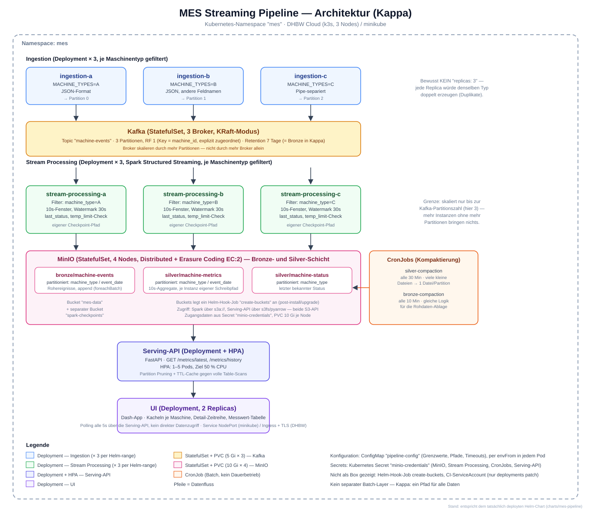

| Komponente | Ordner | Verantwortlich | Aufgabe |
|---|---|---|---|
| Ingestion (× 3) | [`ingestion/`](ingestion/) — [README](ingestion/README.md) | Leo, Kirill | Simulatoren, Normalisierung, Kafka-Producer, je Instanz ein Maschinentyp |
| Kafka | [`charts/mes-pipeline/templates/kafka.yaml`](charts/mes-pipeline/templates/kafka.yaml) | Kirill | Broker im KRaft-Modus (3 Broker), Topic `machine-events`, 3 Partitionen |
| Stream Processing (× 3) | [`stream-processing/`](stream-processing/) — [README](stream-processing/README.md) | Cäcilia | Spark Structured Streaming, je Instanz ein Maschinentyp |
| MinIO | [`ingestion/storage/`](ingestion/storage/) — [README](ingestion/storage/README.md) | Kirill | S3-kompatibler Objektspeicher (4-Node Distributed Mode), Bronze- und Silver-Schicht |
| Kompaktierung (× 2 CronJobs) | [`charts/mes-pipeline/templates/compaction-cronjob.yaml`](charts/mes-pipeline/templates/compaction-cronjob.yaml), [`bronze-compaction-cronjob.yaml`](charts/mes-pipeline/templates/bronze-compaction-cronjob.yaml) | Lars | Fasst viele kleine Streaming-Dateien periodisch zu großen zusammen — siehe §6 |
| Serving-API | [`serving-api/`](serving-api/) — [README](serving-api/README.md) | Aaron | Abfrage-Endpunkte über der Silver-Schicht |
| UI | [`ui/`](ui/) — [README](ui/README.md) | Max | Dashboard |
| Deployment | [`charts/mes-pipeline/`](charts/mes-pipeline/) — [README](charts/mes-pipeline/README.md) | Lars | Helm-Chart, Cluster-Bereitstellung (Terraform + Ansible/k3s) |

**Warum ein Broker dazwischen.** Ohne Kafka wären Ingestion und Verarbeitung fest gekoppelt: Ein
kurzer Ausfall der Verarbeitung würde Ereignisse verlieren, und eine langsame Verarbeitung würde
die Erzeugung ausbremsen. Mit Kafka warten die Ereignisse, die Verarbeitung holt sie nach, und
ein fehlerhafter Lauf lässt sich durch Zurücksetzen des Offsets auf **denselben** Daten
wiederholen.

**Warum `machine_id` als Kafka-Key.** Derselbe Key landet immer in derselben Partition. Dadurch
bleibt die zeitliche Reihenfolge je Maschine garantiert, auch wenn mehrere Konsumenten parallel
lesen. Die Partitionszahl ist damit gleichzeitig die Obergrenze der Parallelität — siehe §8.

**Warum Ingestion und Stream Processing als je drei Instanzen statt einer.** Beide Komponenten
sind entlang derselben Achse (Maschinentyp) horizontal aufgeteilt, nicht über naive
Replica-Vervielfachung — Details und Begründung in §8.

---

## 5. Processing-Logik

Jede der drei Stream-Processing-Instanzen liest aus Kafka (gefiltert auf ihren Maschinentyp),
aggregiert über Event-Time-Fenster und schreibt nach MinIO.

| Baustein | Umsetzung |
|---|---|
| Fenster | 10 Sekunden über Event-Time |
| Late Data | Watermark von 30 Sekunden |
| Aggregate | Durchschnitts-, Minimal- und Maximaltemperatur, Event Count |
| State | letzter bekannter Maschinenstatus (`last_status`) |
| Anreicherung | Grenzwert `TEMP_LIMIT` aus der ConfigMap, Flag `limit_exceeded` |
| Ausgabe | Parquet in `mes-data/silver/machine-metrics`, partitioniert nach `machine_type`/`event_date` |
| Wiederanlauf | Checkpoints in `spark-checkpoints`, je Instanz und je Query ein eigener Pfad |

**Warum Event-Time und nicht Verarbeitungszeit.** Ein Ereignis, das wegen einer Netzstörung
zehn Sekunden später ankommt, gehört fachlich in das Fenster seiner Entstehung, nicht in das
seiner Ankunft. Nur so bleiben die Aggregate über Wiederholungen hinweg identisch.

**Warum eine Watermark nötig ist.** Ohne sie müsste Spark jedes Fenster unbegrenzt offen halten,
falls doch noch ein spätes Ereignis kommt — der Zustand würde monoton wachsen. Die Watermark ist
die explizite Zusage: Nach 30 Sekunden wird ein Fenster geschlossen, Späteres wird verworfen.

**Warum genau 30 Sekunden — eine Lektion aus dem Betrieb.** Der Wert stand ursprünglich bei 20s.
Solange eine einzelne Instanz alle drei Maschinentypen zugleich verarbeitete, dauerte ein
Micro-Batch teils 12–15s gegen einen 10s-Trigger — Ereignisse kamen dadurch regelmäßig „zu spät"
relativ zur Watermark und wurden lautlos verworfen (kein Fehler, keine Log-Zeile, nur fehlende
Zeilen in Silver). Kurzfristig auf 60s angehoben, um das abzufedern. Nach dem Aufteilen in drei
parallele, je auf einen Maschinentyp gefilterte Instanzen (siehe §8) sank die Last pro Instanz
auf ein Drittel, wodurch 30s als Kompromiss aus Sicherheitsmarge und UI-Aktualität reicht.

---

## 6. Speicherkonzept

### Format

**Parquet.** Spaltenorientiert, komprimiert und mit eingebettetem Schema. Für die Abfragen der
Serving-API — „Durchschnittstemperatur je Maschine der letzten Stunde" — werden nur wenige
Spalten gelesen; ein zeilenorientiertes Format wie CSV oder JSON müsste jedes Mal alles lesen.
Kein Delta Lake/Iceberg (siehe §3 und §12) — bewusste Lücke, kein Zeitdruck-Kompromiss.

### Partitionierung

| Tabelle | Partitioniert nach | Warum |
|---|---|---|
| `silver/machine-metrics` | `machine_type`, `event_date` | Die Serving-API filtert praktisch immer nach Zeitraum (Partition Pruning über `event_date`); `machine_type` verhindert zusätzlich, dass die drei parallelen Stream-Processing-Instanzen sich beim Schreiben gegenseitig überschreiben |
| `silver/machine-status` | `machine_type` | Gleicher Grund: drei parallele Schreiber, ein Ziel — ohne Partitionierung würde `mode("overwrite")` den Status der jeweils anderen zwei Maschinentypen löschen |
| `bronze/machine-events` | `event_date` | Rohablage, nur nach Zeit sinnvoll abzugrenzen |

**Warum nicht nach `machine_id`.** Bei potenziell vielen Maschinen entstünde eine sehr große
Zahl kleiner Partitionen. `machine_type` hat nur drei Ausprägungen und deckt trotzdem den
Konflikt zwischen den parallelen Schreibern ab.

### Das Small-Files-Problem — und warum es zwei CronJobs gibt

Spark Structured Streaming schreibt bei jedem Micro-Batch eine neue Datei. Bei einem
10-Sekunden-Trigger über mehrere Stunden Laufzeit entstehen so schnell mehrere Zehntausend
kleine Parquet-Dateien pro Partition (beobachtet: über 70.000 Objekte allein in Bronze nach
einem Tag). Jede Leseanfrage muss dann Zehntausende kleiner Dateien einzeln öffnen, was MinIO
und die Serving-API spürbar belastet — bis hin zu Anfragen, die nicht mehr in nützlicher Zeit
beantwortet werden.

Lösung: zwei Kubernetes-`CronJob`s, die periodisch die aktuelle Partition neu einlesen und als
eine einzige, große Datei zurückschreiben (`silver-compaction` alle 30 Minuten,
`bronze-compaction` alle 10 Minuten, wegen der höheren Schreibrate in Bronze durch drei parallele
Instanzen). Das ist **kein** inkrementelles Verfahren — jeder Lauf liest die komplette aktuelle
Partition (alte konsolidierte Datei plus alle neuen kleinen Dateien seit dem letzten Lauf) und
schreibt sie als eine Datei neu. Die Dateizahl folgt dadurch einem Sägezahn-Muster (kompaktiert
→ wächst bis zum nächsten Lauf → kompaktiert), akkumuliert aber nicht über die Zeit.

Zwei Besonderheiten, die der Betrieb tatsächlich gezeigt hat:

- **Bronze wird von Sparks nativem Structured-Streaming-Sink beschrieben** und legt dabei einen
  `_spark_metadata`-Konsistenz-Log an. Ein normaler Batch-Read der Tabellenwurzel nutzt diesen
  Log als Dateiliste statt einer echten Verzeichnis-Auflistung — nach einer Kompaktierung
  verweist er auf bereits gelöschte Dateien. Die Kompaktierung liest und schreibt deshalb bei
  einspaltiger Partitionierung direkt den betroffenen Partitionsordner, statt über die
  Tabellenwurzel zu gehen, und umgeht den Log damit vollständig.
- **`count()` und der anschließende `write()` dürfen nicht zwei unabhängige Lesevorgänge sein.**
  Ohne `.cache()` wertet Spark denselben DataFrame zweimal aus — einmal fürs Zählen, einmal
  fürs Schreiben. Läuft dazwischen ein weiterer Streaming-Micro-Batch, sieht der zweite Read
  eine andere Dateiliste als der erste, und der Commit scheitert mit `FileNotFoundError`.

### Retention

Kafka hält die Rohereignisse 7 Tage (168 h) im Log. Zusätzlich läuft seit der Kompaktierung ein
dauerhaftes Rohdaten-Archiv in `bronze/machine-events` in MinIO — über die 7 Tage des
Kafka-Logs hinaus, für genau die in §12 benannte Lücke des reinen Kappa-Ansatzes.

---

## 7. User-facing UI

Die Weboberfläche zeigt die Maschinenübersicht der Pipeline live an — eine Kachel je Maschine
mit den aktuellen Aggregatwerten aus der Silver-Schicht, dazu ein Temperaturverlauf im Detail.

**Datenanbindung.** Die UI spricht ausschließlich mit der Serving-API (`GET /metrics/latest` für
die Übersicht, `GET /metrics/history` für den Verlauf) — kein direkter Zugriff auf Kafka, Spark
oder MinIO. Das hält das Architekturdiagramm konsistent zum tatsächlichen Datenfluss.

| Element | Feld | Warum es überzeugt |
|---|---|---|
| Kachel je Maschine | `machine_id`, `machine_type` | zeigt, dass alle drei Rohformate ankommen |
| Aktuelle Temperatur | `avg_temperature`, `min_temperature`, `max_temperature` | zeigt die Aggregation |
| **Warnung bei Überhitzung** | `limit_exceeded` | zeigt die ConfigMap-Anreicherung |
| Status | `last_status` | zeigt den Streaming-State |
| Messwerte im Fenster | `event_count` | zeigt Windowing und Datenausfall |
| Zeitreihe | `/metrics/history` | zeigt das Data Lake |

Die Warnung bei `limit_exceeded` ist das stärkste Element: Sie beweist in einem einzigen
Screenshot, dass ein Wert aus einer Kubernetes-ConfigMap durch einen Spark-Job bis in die
Oberfläche wirkt.

**Bedienablauf.** Übersichtsseite mit allen Maschinen als Kacheln (Ampel-Farbe nach Status/
`limit_exceeded`) — Klick auf eine Kachel führt zur Detailseite dieser einen Maschine mit
Temperaturverlauf. Echte Navigation über die URL (`/machine/<id>`), kein Dropdown-Zustand auf
einer einzelnen Seite.

---

## 8. Kubernetes-Deployment

**Aus der Aufgabenstellung:** „Skalierbarkeit: die Anwendung muss darauf ausgelegt sein, in
allen Komponenten horizontal zu skalieren und dies soll gezeigt werden."

| Komponente | Zustand | Mechanismus | Skalierungseinheit | Nachweis |
|---|---|---|---|---|
| Ingestion | zustandslos | **3 separate Deployments** (`ingestion-a/b/c`), je `MACHINE_TYPES` gefiltert | Maschinentyp | `kubectl get pods -l mes.family=ingestion` |
| Stream Processing | Checkpoint in MinIO | **3 separate Deployments** (`stream-processing-a/b/c`), je `MACHINE_TYPES` gefiltert, isolierte Checkpoints | Maschinentyp / Kafka-Partition | `kubectl get pods -l mes.family=stream-processing` |
| Serving-API | zustandslos | **HPA** auf CPU (1–5 Pods, Ziel 50 %) | HTTP-Request | `kubectl get hpa -w` |
| UI | zustandslos | Deployment-Replicas | HTTP-Request | `kubectl scale` |
| Kafka | StatefulSet + PVC | **3 KRaft-Broker** | Partition | `kafka-topics --describe`: Partitionen mit unterschiedlichen Leadern (0, 1, 2) |
| MinIO | StatefulSet + PVC | **4-Node Distributed Mode**, Erasure Coding | Knoten | `mc admin info`: vier Knoten online, EC:2 |

**Warum Ingestion und Stream Processing nicht über `replicas: N` skalieren.** Beide Komponenten
sind zustandsbehaftete Erzeuger/Konsumenten je Maschinentyp — eine einfache Replica-Erhöhung
würde bei der Ingestion denselben Typ mit denselben `machine_id`s mehrfach erzeugen
(Duplikate), und bei Stream Processing mehrere unabhängige Spark-Anwendungen erzeugen, die
dasselbe Kafka-Topic vom selben Offset läsen und dieselben Aggregate mehrfach schrieben. Die
tatsächliche Skalierung läuft daher über den Helm-`range`-Mechanismus in
[`charts/mes-pipeline/templates/ingestion.yaml`](charts/mes-pipeline/templates/ingestion.yaml)
und [`stream-processing.yaml`](charts/mes-pipeline/templates/stream-processing.yaml): eine
Liste von Instanzen in `values.yaml`, jede mit eigenem `MACHINE_TYPES`-Filter, eigenem Deployment
und — bei Stream Processing zusätzlich — eigenem Spark-Checkpoint-Pfad, damit sich die drei
Instanzen nicht gegenseitig den Zustand überschreiben.

**Eine bewusste Grenze:** Mehr Ingestion-/Stream-Processing-Instanzen als Kafka-Partitionen
bringen nichts. Drei Partitionen heißen: sinnvolle Parallelität endet bei drei Instanzen. Wer
weiter skalieren will, erhöht zuerst die Partitionszahl.

Bei genügend Last werden MinIO oder Kafka zum Engpass, nicht die Serving-API.

**Eine zweite, unabhängige Grenze — lokale Testumgebung, nicht die Cloud:** Kafka (3 Broker) und
MinIO (4 Knoten) gleichzeitig auf einer einzigen minikube-VM sättigen deren Disk-I/O
(beobachtet: ~32 % I/O-Wait, Load-Average 45-70 auf 16 Kernen) — der Node wechselt kurzzeitig
zwischen `Ready`/`NotReady`, einzelne Pods (auch `metrics-server`) werden neu gestartet, weil
ihre Probes wegen des I/O-Rückstaus timeouten. Kein Konfigurationsfehler und keine
Instabilität der Anwendung selbst — sieben Storage-Pods, die sich eine gemeinsame virtuelle
Platte teilen, sind ein reines Kapazitätsproblem der lokalen Entwicklungsumgebung. Auf der DHBW
Cloud verteilt sich dieselbe I/O-Last über drei echte VMs mit jeweils eigener Platte, wo dieses
Muster in der Form nicht zu erwarten ist.

---

## 9. Deployment-Anleitung

### Voraussetzungen

| Werkzeug | Zweck |
|---|---|
| Docker | Images bauen |
| kubectl, Helm | Deployment |
| minikube | lokale Entwicklungsumgebung |
| Terraform, Ansible, OpenStack-CLI | Cluster in der DHBW Cloud |

### Ein Chart, zwei Umgebungen

```bash
# minikube
helm upgrade --install mes ./charts/mes-pipeline -f values-secret.yaml --namespace mes --create-namespace --wait

# DHBW Cloud
helm upgrade --install mes ./charts/mes-pipeline -f values-secret.yaml -f ./charts/mes-pipeline/values-dhbw.yaml --namespace mes --create-namespace --wait
```

`values-dhbw.yaml` überschreibt nur die paar Werte, die sich zwischen den Umgebungen
unterscheiden — Image-Registry, `imagePullPolicy`, UI-Service-Typ und Ingress. Alles andere
(Kafka mit 3 Brokern, MinIO mit 4 Knoten, die HPA auf der Serving-API, die Kompaktierungs-
CronJobs) ist exakt dasselbe Chart.

### DHBW Cloud

**1. Zugang.** Die Cloud ist nur aus dem DHBW-Netz erreichbar (Eduroam oder VPN) und rein IPv6.
Die Anmeldung von Werkzeugen erfolgt über ein **Application Credential**, nicht über Benutzername
und Passwort — die Anmeldung an der Weboberfläche läuft über SSO, ein Passwort existiert dafür
nicht. Die erzeugte `clouds.yaml` liegt außerhalb des Repositories.

**2. Infrastruktur.** Details dazu in [`terraform/README.md`](terraform/README.md).

```bash
cd terraform
terraform init
terraform plan
terraform apply
```

Erzeugt drei VMs im Netz `DHBWV6` — einen Master (`general.medium`, 4 vCPU) und zwei Worker
(`general.small`, 2 vCPU, macht 8 vCPU insgesamt) — und schreibt aus deren Adressen unmittelbar
das Ansible-Inventar sowie `cluster.env`. Das ist der Kern des Infrastructure-as-Code-Gedankens:
**Die Ausgabe des einen Werkzeugs ist die Eingabe des nächsten**, es wird keine Adresse von Hand
übertragen.

Sechs Anpassungen gegenüber der Vorlage aus dem Übungs-Track waren nötig:

| | Vorlage | Hier | Warum |
|---|---|---|---|
| Anmeldung | Benutzer + Passwort | Application Credential | SSO, es gibt kein Passwort mehr |
| Netz | `DHBW-1-Upper` | `DHBWV6` | in der neuen Cloud umbenannt |
| Image | feste `image_id` | Auflösung über den Namen | die IDs der Vorlage existieren nicht mehr; die DHBW ersetzt Images regelmäßig |
| Flavor | `m1.extra_large` (8 vCPU) für alle Knoten | `general.medium`/`general.small` | 3 × 8 vCPU je Gruppe erschöpften das gemeinsame Projektkontingent (100 vCPU für den ganzen Kurs) |
| Adressen | `fixed_ip_v4` | `fixed_ip_v6`, `ip_family: ipv6` | die privaten IPv4 sind von außen nicht erreichbar |
| Kontingent nachträglich anpassen | — | `terraform apply -replace=<resource>` | OpenStack erlaubt Resize nur nach oben; Disk-Verkleinerung braucht einen Neubau |

**3. Kubernetes.** k3s wird nicht manuell installiert, sondern über die offizielle, öffentlich
verfügbare Ansible-Rolle
[`k3s-dhbw-cloud-role`](https://github.com/pfisterer/k3s-dhbw-cloud-role) — verlinkt aus der
Vorlesung „Cloud Infrastructures and Cloud Native Applications":

```bash
ansible-galaxy install -r requirements.yml
ansible-galaxy collection install kubernetes.core
ansible-playbook ansible/playbook.yml \
  -i terraform/generated-inventory.yml \
  -i ansible/overrides.yml
```

Die Rolle erkennt IPv4/IPv6 automatisch (`ip_family: auto`), installiert k3s als Server auf dem
Master und als Agent auf den Workern, und liefert eine fertig adressierte Kubeconfig. Zwei
Standardeinstellungen wurden bewusst überschrieben: **Longhorn** (repliziertes Storage,
automatisch an bei drei Knoten) ist aus — bei 124 MB Tagesvolumen unnötiger Ausfallpunkt — und
**automatische nächtliche k3s-Updates** sind aus, damit kein Cluster-Neustart mitten in die
Projektwoche fällt.

**4. Anwendung deployen.** Siehe "Ein Chart, zwei Umgebungen" oben.

**5. Erreichbarkeit von außen: Cloudflare Tunnel.** Die DHBW Cloud ist bewusst abgeschottet —
nur aus dem DHBW-Netz (Eduroam/VPN) erreichbar und rein IPv6. Für Werkzeuge, die *von außen*
zugreifen müssen und weder im DHBW-Netz sitzen noch IPv6 sprechen — insbesondere die
GitHub-Actions-Runner (öffentliches Internet, kein DHBW-Netz) — reicht die Cluster-Adresse
allein nicht. Vier separate Cloudflare-Quick-Tunnel (`tools/tunnel-start-*.sh`) lösen das,
jeder mit einer eigenen, öffentlich erreichbaren HTTPS-Adresse (`*.trycloudflare.com`), die auf
einen internen Dienst zeigt:

| Tunnel | Zeigt auf | Warum |
|---|---|---|
| Registry | Docker-Registry im Cluster | GitHub Actions muss Images pushen können |
| K8s-API | `https://localhost:6443` auf dem Master | GitHub Actions muss `kubectl rollout restart` ausführen können |
| UI | UI-Service | Bequemer Zugriff ohne VPN, z. B. für Screenshots |
| MinIO-Konsole | MinIO-Service | Diagnose ohne VPN |

Jeder Tunnel ist ephemer — die Adresse ändert sich bei jedem Neustart. Ein kleines Skript
schreibt die aktuelle Registry- bzw. K8s-API-Adresse deshalb automatisch in die
GitHub-Repository-Variablen (`REGISTRY_HOST`, `K8S_API_HOST`), statt sie von Hand zu pflegen.

**Eine ehrliche Grenze dieser Lösung:** Kostenlose Cloudflare-Quick-Tunnel begrenzen einzelne
Requests auf 100 MB. Das betrifft ausschließlich den Image-Push von `stream-processing` (siehe
Punkt 6) — Lesezugriffe (Pulls, `kubectl`-API-Calls) sind davon nicht betroffen.

**6. CI/CD.** Vier GitHub-Actions-Workflows (`.github/workflows/build-*.yml`) bauen bei jedem
Push das jeweilige Image, pushen es über den Registry-Tunnel und lösen einen
`kubectl rollout restart` über den K8s-API-Tunnel aus — mit einer eigens dafür angelegten, auf
`apps/deployments` (get/list/patch) beschränkten ServiceAccount-Rolle, kein
Cluster-Admin-Zugriff für CI. Eine ehrliche Grenze: `stream-processing` bäckt beim Build
~700 MB an Spark-/Hadoop-Paketen ins Image (um Maven-Central-Rate-Limits im laufenden Betrieb
zu vermeiden), was das 100-MB-Limit des Registry-Tunnels sprengt — für diese eine Komponente
läuft Build & Push deshalb manuell, CI übernimmt nur noch den Rollout-Restart.

### Abbau

```bash
cd terraform && terraform destroy
```

Erst **nach** den Screenshots. Die VMs belegen bis dahin Kontingent, das sich der ganze Kurs teilt.

---

## 10. Wesentliche Codeabschnitte

Verlinkte Dateien mit je einem Satz, warum die Stelle wesentlich ist — kein „hier wird X
gemacht", sondern was daran eine Entscheidung oder ein Verständnis zeigt.

| Datei | Warum wesentlich |
|---|---|
| `ingestion/schema/unified_schema.py` | die Normalisierung dreier Rohformate — der fachliche Kern |
| `ingestion/producer/kafka_producer.py` | `machine_id` als Partition-Key, sichert Reihenfolge je Maschine |
| `stream-processing/streaming_job.py` | Fenster, Watermark, Maschinentyp-Filter für die horizontale Skalierung, Partitionierung (`machine_type`, `event_date`) |
| `stream-processing/compact.py` | periodische Kompaktierung gegen das Small-Files-Problem, mit Retry gegen S3-Commit-Races |
| `serving-api/app/storage.py` | Partition Pruning + TTL-Cache gegen wiederholte Full-Scans durch Readiness-Probes, `load_table()` |
| `ui/data_source.py` | Anbindung an die Serving-API statt Mock, kurzer serverseitiger Cache gegen Mehrfachanfragen |
| `charts/mes-pipeline/templates/kafka.yaml` | `podManagementPolicy: Parallel` + `publishNotReadyAddresses` — die beiden Bootstrapping-Deadlocks beim 3-Broker-Umbau |
| `charts/mes-pipeline/templates/ingestion.yaml`, `stream-processing.yaml` | Helm-`range` über eine Instanzliste statt `replicas: N` — die eigentliche horizontale Skalierung |
| `charts/mes-pipeline/templates/serving-api.yaml` | HPA ohne von Helm verwaltete `replicas` — kein Kampf zwischen `helm upgrade` und der Autoskalierung |
| `charts/mes-pipeline/templates/compaction-cronjob.yaml`, `bronze-compaction-cronjob.yaml` | periodische Kompaktierung als eigener, kurzlebiger Workload-Typ statt Dauerbetrieb |

---

## 11. Screenshots und Nachweise

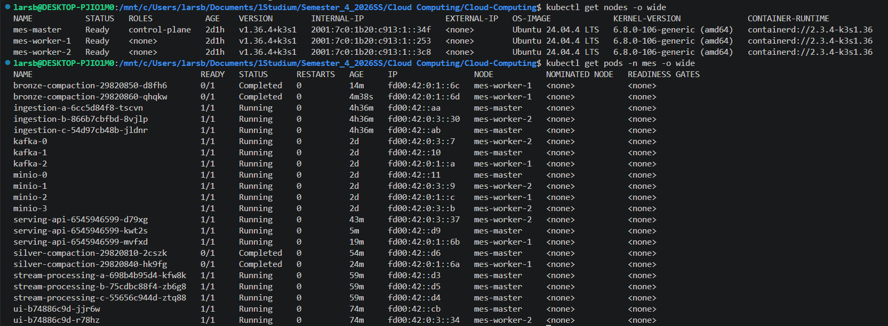
*Alle Workloads im Namespace `mes` — Vielfalt der Workload-Typen (Deployment, StatefulSet, CronJob).*

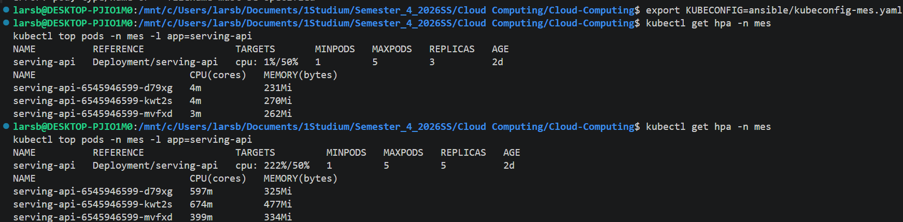
*Horizontal Pod Autoscaler der Serving-API unter Last.*

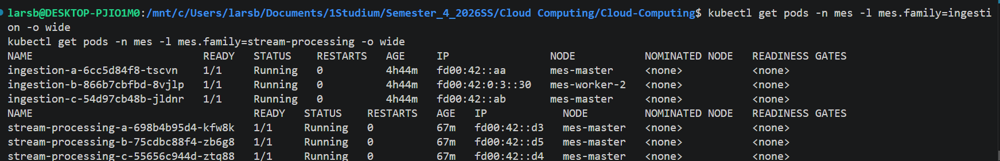
*Drei Ingestion- und drei Stream-Processing-Instanzen, je einem Maschinentyp zugeordnet.*

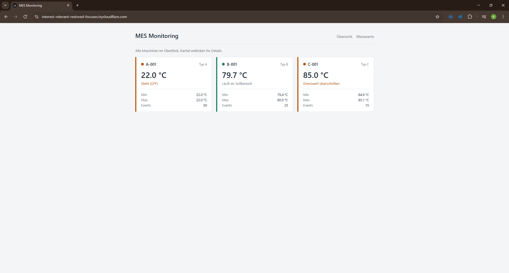
*Maschinenübersicht mit einer Kachel je Maschine.*

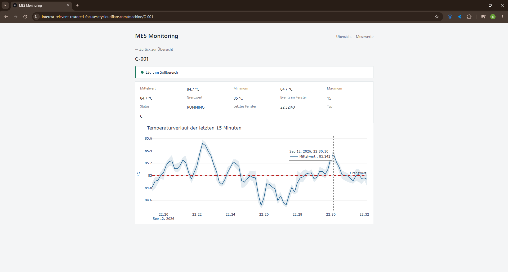
*Detailansicht einer Maschine mit `limit_exceeded`-Warnung — die ConfigMap wirkt bis in die UI.*

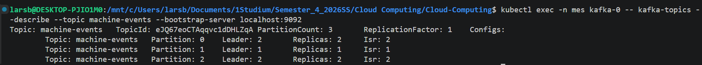
*Drei Partitionen mit unterschiedlichen Broker-Leadern.*

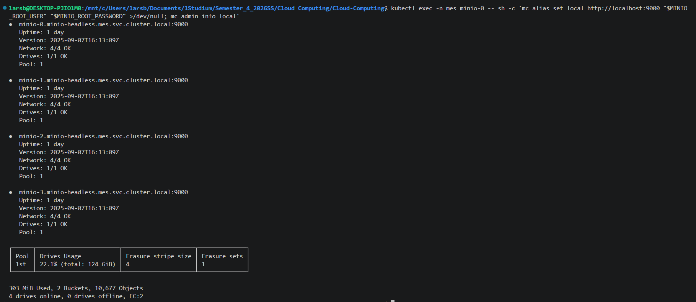
*Vier MinIO-Knoten online, Erasure Coding aktiv.*

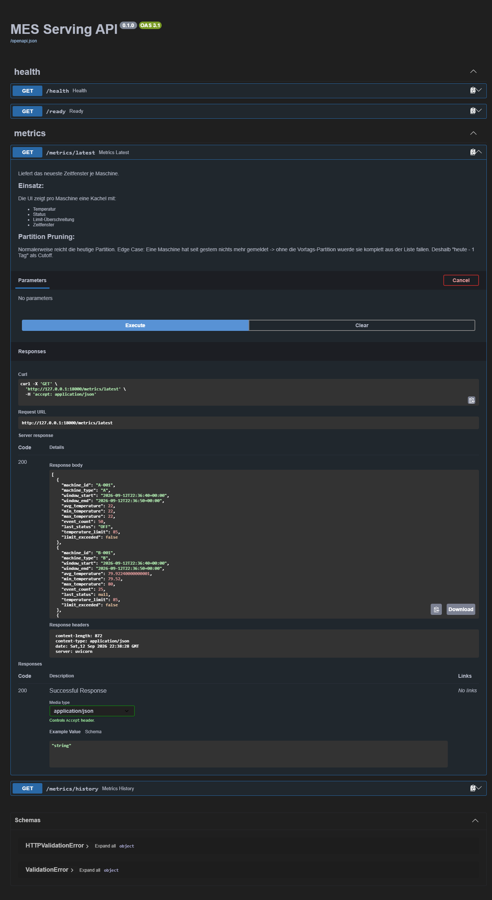
*Interaktive API-Dokumentation mit allen Endpunkten.*

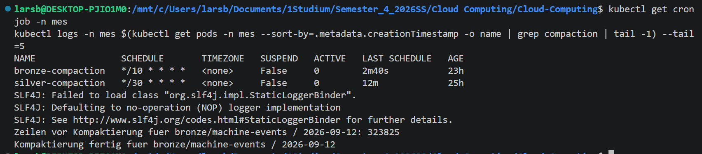
*Silver- und Bronze-Kompaktierung als eigene CronJobs, mit erfolgreichem letzten Lauf.*

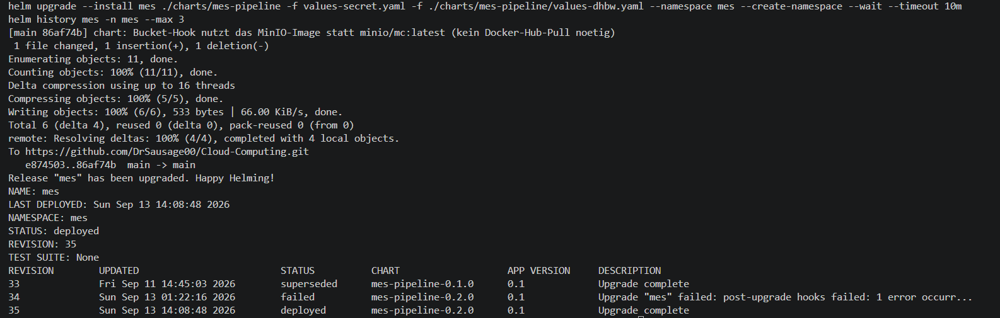
*Reproduzierbarkeit: `helm upgrade --install` auf einem frischen Cluster.*

---

## 12. Grenzen und Ausblick

Dieser Abschnitt benennt bewusst, was der Prototyp **nicht** leistet. Eine ehrlich benannte
Lücke kostet weniger als eine Behauptung, die im Gespräch nicht trägt.

### Datenvolumen

124 MB am Tag sind kein Big Data. Die Architektur ist auf ein Vielfaches ausgelegt, der
Prototyp erzeugt es nicht. Die Simulatoren verwenden zudem nur drei verschiedene `machine_id` —
für eine realistische Partitionsverteilung wären mehr nötig.

### Skalierbarkeit der Verarbeitung — inzwischen umgesetzt, mit einer ehrlichen Obergrenze

Frühere Zwischenstände dieses Projekts liefen mit `.master("local[2]")` fest verdrahtet in
einem einzigen Pod. Inzwischen läuft sowohl Ingestion als auch Stream Processing als drei
parallele, je auf einen Maschinentyp gefilterte Instanzen (§8) — die Anforderung
„Skalierbarkeit in allen Komponenten" ist damit für diese beiden Komponenten erfüllt, nicht nur
behauptet. Die verbleibende, bewusste Grenze: Die Parallelität ist an die Anzahl der
Kafka-Partitionen (3) gekoppelt, nicht beliebig weiter erhöhbar, ohne zuerst die Partitionszahl
zu ändern.

### Bronze-Schicht

Die Rohereignisse liegen im Kafka-Log (7 Tage Retention) und zusätzlich dauerhaft in
`bronze/machine-events` in MinIO. Nach den 7 Tagen ist ein Offset-Reset über Kafka nicht mehr
möglich, die materialisierte Bronze-Kopie bleibt aber bestehen.

### Kein Katalog, kein Table Format

Ohne Delta oder Iceberg gibt es keine ACID-Transaktionen, kein Time Travel und keine
Schema-Evolution. Ein gleichzeitiger Schreib- und Lesevorgang auf dieselbe Partition kann eine
inkonsistente Sicht liefern — das haben wir bei der Kompaktierung konkret beobachtet (§6):
Kompaktiert ein CronJob dieselbe, gerade noch aktiv beschriebene Tages-Partition, kann der
S3-Commit scheitern. Für den Prototyp lösen wir das über Retries, nicht über ein
transaktionales Table Format.

### Betrieb

Kein zentrales Logging, keine Metriken, kein Alerting. Fehler werden über `kubectl logs`
gefunden. Ein Observability-Stack wäre der nächste Schritt.

### Serving-API-Cache

Der In-Memory-Cache der Serving-API ist pro Pod getrennt — bei mehreren Pods (HPA) liest jeder
seinen eigenen Cache, MinIO wird also bei Skalierung mehrfach unabhängig angefragt statt einmal
gemeinsam. Ein geteilter Redis-Cache ist vorbereitet (`REDIS_HOST`-Konfiguration existiert),
aber noch nicht deployt.

### Was als Nächstes käme

1. Materialisierte Gold-Schicht mit MES-Kennzahlen (OEE, Verfügbarkeit je Schicht)
2. Delta Lake statt reinem Parquet für ACID und Schema-Evolution
3. Geteilter Redis-Cache statt In-Memory-Cache pro Serving-API-Pod
4. Observability-Stack
5. Automatisierte Tests der Normalisierung
6. Generische Feldübertragung (aktuell sind Feldnamen an mehreren Stellen — Aggregation,
   API-Serialisierung, UI-Spalten — fest verdrahtet; neue Messgrößen brauchen aktuell noch
   Codeänderungen an drei Stellen statt reiner Konfiguration)
